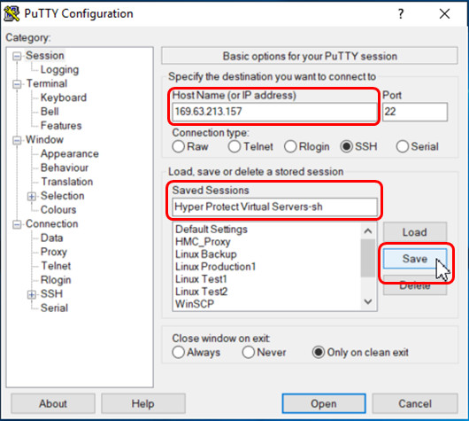

---

copyright:
  years: 2019, 2021
lastupdated: "2021-08-19"

subcollection: hp-virtual-servers

keywords: connect, logging in, OpenSSH
---

{:external: target="_blank" .external}
{:shortdesc: .shortdesc}
{:screen: .screen}
{:codeblock: .codeblock}
{:note: .note}
{:important: .important}
{:tip: .tip}
{:pre: .pre}

# Connecting to a virtual server
{: #connect_vs}

For a successfully provisioned virtual server, you can log in to this instance by using your preferred method.
{: shortdesc}

- Due to configuration processes, you need to wait up to 30 minutes until you can connect to a new virtual server for the first time.

- The Ubuntu servers are preconfigured in such a way that the passwords expire after 90 days. After the user password expires, you have 30 days to change your password. If you don't change your password within the 30 days, your account becomes inactive and you can't log in by way of SSH even if you are using SSH-keys. For more information, see [Protecting a virtual server](/docs/hp-virtual-servers?topic=hp-virtual-servers-protect_vs).

- If the `outbound-only` parameter is set when the Virtual Server is created, it is not possible to connect to this server's public IP address. In this case, connect to another server created by the same account in the same region with an inbound IP address, and then connect from this server to the "outbound-only" server via its' private IP address.

## Logging-in from an OpenSSH client
{: #logging_ssh_client}

The syntax of log-in commands from an OpenSSH client available in various operating systems is nearly the same
in all such operating systems. Examples for operating systems with an enabled OpenSSH client are:
* Linux
* Windows 10 with an enabled built-in SSH client (which is the default for most current installations)
* Windows Subsystem for Linux (WSL)
* Windows by using Git Bash
* macOS

For example, in Windows 10, you can connect to your virtual server from a command prompt or from a PowerShell window.
Or for older Windows versions, you can open a Git Bash session and log-in as *root* user. Provide the following additional information:
* Specify the public IP address of the created virtual server instance. You can find it on the {{site.data.keyword.hpvs}} dashboard as shown in Figure 1 of [Retrieving information about a virtual server](/docs/services/hp-virtual-servers?topic=hp-virtual-servers-retrieve-info-vs). In the shown command example, `198.51.100.21` is used as IP address.
* Specify the file (name and location, if necessary) that contains your private key with the `-i` parameter. In the command example, the key file `id_rsa` must be located in the current directory.  

`$ ssh root@<public_ip_address> -i <path_to_priv_key_file>`

```sh
ssh root@198.51.100.21 -i id_rsa
```
{: codeblock}


If you log in for the first time, the new server is not yet known to SSH, and therefore, you receive the following message:  

`The authenticity of host '198.51.100.21 (198.51.100.21)' can't be established.
ECDSA key fingerprint is SHA256:dVaFv4slDyiYZcUV5F6MKqhxIo4SuucWkXVQoc4MTIk.
Are you sure you want to continue connecting (yes/no/[fingerprint])?`

Answer `yes` to allow SSH to add your server to the list of known hosts:

`Warning: Permanently added '52.116.6.26' (ECDSA) to the list of known hosts.`
`Welcome to Ubuntu 20.04.2 LTS (GNU/Linux 5.4.0-74-generic s390x)`

## Logging-in from Windows by using **PuTTY Configuration**
{: #connect_vs_with_putty}


A convenient method to connect to a server is to use the **PuTTY Configuration** utility.
You can ease the logon and authentication to your virtual server with your private SSH key.

1. Define the virtual server in the **Session** category of **PuTTY Configuration**.
    - Enter the server's hostname or public IP address as shown.
    - Enter a name into the **Saved Sessions** field. In the shown example, this session name is the service name as specified during provisioning.
    - Click **Save**.

   {: caption="Figure 1. Defining a new virtual server instance" caption-side="bottom"}

2. In the **SSH->Auth** category, specify the file that contains the private SSH key.  

   {: caption="Figure 2. Providing the private SSH key for authentication" caption-side="bottom"}


   For SSH key pairs generated other than using **PuTTY**, you can use **Conversions -> Import key** of the **PuTTY Key Generator** to convert the private key into the **PuTTY** format of the same length.
3. Define the **root** default username under **Connection -> Data**.

   {: caption="Figure 3. Defining the auto-login username" caption-side="bottom"}


4. Go back to the session configuration shown in Figure 1 and click **Save** again. Otherwise, you lose your changes.

From now on, you can open and log in to this server as **root** user without the need to specify your private SSH key.
