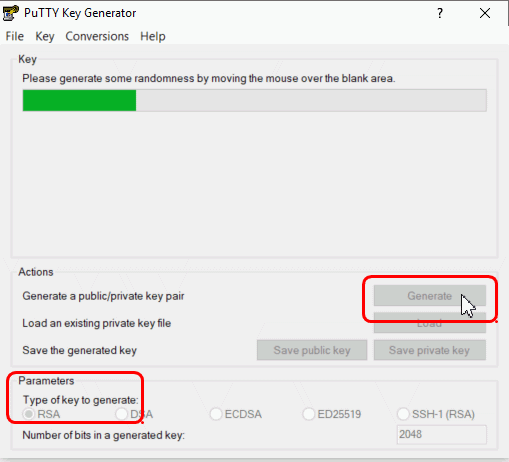
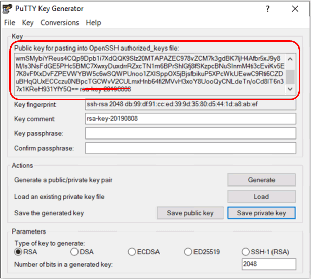

---

copyright:
  years: 2019
lastupdated: "2019-08-16"

subcollection: hp-virtual-servers

---

{:external: target="_blank" .external}
{:shortdesc: .shortdesc}
{:screen: .screen}
{:codeblock: .codeblock}
{:note: .note}
{:important: .important}
{:tip: .tip}
{:pre: .pre}

#Generating SSH keys
{: #generate_ssh}

Before you can create an instance of {{site.data.keyword.hpvs}}, you must have a pair of private and public SSH keys available. You can either reuse an existing SSH key pair or generate a new one.

* You need the public key as input during the creation of the new server instance.
* You need the private key when you log in to the server instance. Keep it as a secret on your workstation.

This pair of SSH keys is then used for authentication between your client and your new server.
{:shortdesc}

The following cryptographic algorithms are supported by {{site.data.keyword.hpvs}} for generating SSH keys:

* `ssh-ed25519`            
* `ssh-rsa`   (this is the default)             
* `ssh-dsa`                
* `ecdsa-sha2-nistp256`    
* `ecdsa-sha2-nistp384`    
* `ecdsa-sha2-nistp521`

## Generating SSH keys from a Unix-like operating system

The method of creating an SSH key pair in Unix-like operating systems is nearly the same in all such operating systems. Examples for Unix-like operating systems are:
* Linux
* Windows Subsystem for Linux (WSL)
* Windows using Git Bash
* macOS

If you need or want to use a new authentication key pair for SSH, run the **ssh-keygen** tool from the command prompt. You are prompted to optionally choose a key file name and a passphrase.

The shown sample instructions are issued from a Git Bash session under Windows:

```
ssh-keygen
ssh-keygen -t rsa
ssh-keygen -t rsa -b 4096 -C "your_email@example.com"
```
{: codeblock}

The `-t`, `-b`, and  `-C` parameters are all optional.  
`-t` specifies the key type. `-t rsa` is default.
`-b` designates the key size in bits. The default size is 2048 bits.
`-C` adds a comment.
So if you invoke `ssh-keygen` without any arguments, the command generates an	RSA key pair with a size of 2048 bits for both keys.  

You can select from the supported cryptographic algorithms by using the `-t` parameter in the **ssh-keygen** tool:
```
ssh-ed25519            --> ssh-keygen -t ed25519
ssh-rsa                --> ssh-keygen -t rsa    (the default)
ssh-dsa                --> ssh-keygen -t dsa
ecdsa-sha2-nistp256    --> ssh-keygen -t ecdsa -b 256
ecdsa-sha2-nistp384    --> ssh-keygen -t ecdsa -b 384
ecdsa-sha2-nistp521    --> ssh-keygen -t ecdsa -b 521
```
{: codeblock}

{:note}
If you do not specify a file name to save the key, a default name is used.
The private and public SSH key pair is stored in two files with the same name. The public SSH key, which is required for creating an instance of {{site.data.keyword.hpvs}} is saved in the file with extension `.pub`.
The generated keys can vary in format when generated with different methods or on different operating systems. Valid formats are recognized when entered as input during the creation of a server instance.

###Saving the SSH private key to the SSH agent

If you created your SSH key pair with a passphrase, you can add your SSH private key to the SSH agent so that you need not enter the passphrase every time. This is an optional task.

* Run the following command: eval "$(ssh-agent -s)"
* Note: If your system is macOS Sierra 10.12.2 or later, you need to modify your `~/.ssh/config` file to enable adding keys to the agent and that uses your keychain to store passphrases:

 ```
 Host *    
   AddKeysToAgent yes
   UseKeychain yes
   IdentityFile ~/.ssh/id_rsa
 ```
 {: codeblock}

* Enter `ssh-add ~/.ssh/id_rsa` (for mac systems, enter `ssh-add -K ~/.ssh/id_rsa`) to add your SSH private key to the ssh-agent. If your private key file has a different name, replace `id_rsa` with the file name.

For more detailed information, see [Generating a new SSH key and adding it to the ssh-agent](https://help.github.com/en/articles/generating-a-new-ssh-key-and-adding-it-to-the-ssh-agent).

## Generating SSH keys from Windows using the **PuTTY Key Generator**

To generate an SSH key pair by using the **PuTTY Key Generator**, select the type of key and the key size (for example, 2048 or 4096).




*Figure 1. Generating an SSH key pair with the **PuTTY Key Generator***

You can select one of the supported cryptographic algorithms from the **PuTTY Key Generator** dialog by clicking an appropriate option for the **Type of key to generate**. For the ECDSA option, a pull-down choice appears where you must additionally select a **Curve to use for generating this key** (either `nistp256`, `nistp384`, or `nistp521`).

You must then save the private, and optionally the public key, into separate files by pressing the appropriate buttons (**Save public key**, **Save private key**). To reuse the public key saved this way for creating an HP-VS instance, ensure that you use the OpenSSH public key format that is recognized by {{site.data.keyword.hpvs}}.
{:important}

To create an HP-VS instance with a **PuTTY** public SSH key, you have the following choices:

- To create the HP-VS instance directly after the key pair generation, copy the public key from the **Key** box, including the string 'ssh-rsa' at the beginning, but without the key comment at the end as shown in Figure 2.
- To create the instance at a later point in time, after the **PuTTY Key Generator** dialog is already closed, you can use the public key from a saved file in the OpenSSH public key format.



*Figure 2. SSH key pair from the **PuTTY Key Generator** ready for use*
