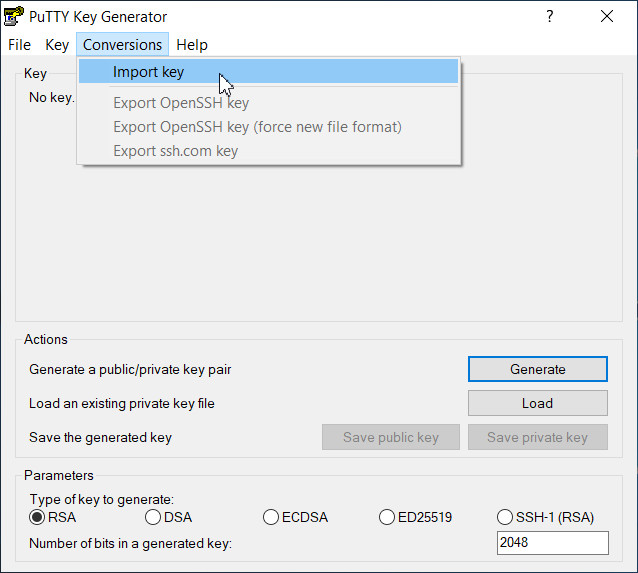
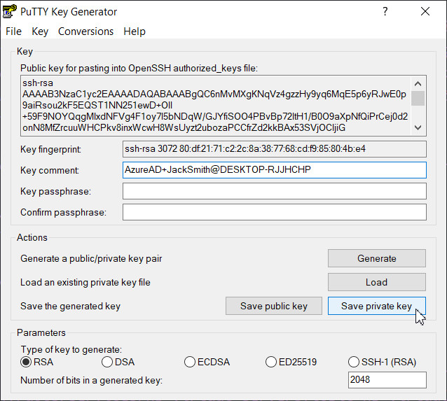

---

copyright:
  years: 2019, 2023
lastupdated: "2023-02-28"

subcollection: hp-virtual-servers

keywords: ssh public keys, OpenSSH, add ssh key, ssh key, manage ssh key, virtual server instance, instance, virtual server

---


{{site.data.keyword.attribute-definition-list}}

# Generating SSH keys
{: #generate_ssh}

Before you can create a virtual server, you must have a pair of private and public SSH keys available. You can either reuse an existing SSH key pair or generate a new one. You can also reuse an existing OpenSSH key pair for use in **PuTTY**.
{: shortdesc}

* You need the public key as input during the creation of a new virtual server.
* You need the private key when you log in to the virtual server. Keep it as a secret on your client workstation.

This pair of SSH keys is then used for authentication between your client and your new server.


The following cryptographic algorithms are supported by {{site.data.keyword.hpvs}} for generating SSH keys:

* `ssh-rsa`   (the default)             
* `ssh-ed25519`            
* `ecdsa-sha2-nistp256`    
* `ecdsa-sha2-nistp384`    
* `ecdsa-sha2-nistp521`

## Generating SSH keys with a command
{: #generating_ssh_command}

The method of creating an SSH key pair from the command line of the listed operating systems is nearly the same in all such operating systems:
* Linux
* Windows Subsystem for Linux (WSL)
* Windows by using Git Bash
* Windows 10
* macOS

If you need or want to use a new authentication key pair for SSH, run the **ssh-keygen** tool from the command line. You are prompted to optionally choose a key file name and a passphrase.

The shown sample instructions can be entered from either
- A Git Bash session under Windows
- A Windows 10 session
- A Linux session

```sh
ssh-keygen
```
{: codeblock}

```sh
ssh-keygen -t rsa
```
{: codeblock}

```sh
ssh-keygen -t rsa -b 4096 -C "your_email@example.com"
```
{: codeblock}

The `-t`, `-b`, and  `-C` parameters are optional.
- `-t` Specifies the key type. The default is `-t rsa`.
- `-b` Designates the key size in bits. The default size is 2048 bits.
- `-C` Adds a comment.

So if you invoke `ssh-keygen` without any arguments, the command generates an	RSA key pair with a size of 2048 bits for both keys.  

You can select from the supported cryptographic algorithms by using the `-t` parameter in the **ssh-keygen** tool:

| Algorithm | Command |
|-------|------------------|
|`ssh-rsa`|`ssh-keygen -t rsa`   (default)|
|`ssh-ed25519`|`ssh-keygen -t ed25519`|
|`ecdsa-sha2-nistp256`|`ssh-keygen -t ecdsa -b 256`|
|`ecdsa-sha2-nistp384`|`ssh-keygen -t ecdsa -b 384`|
|`ecdsa-sha2-nistp521`|`ssh-keygen -t ecdsa -b 521`|
{: caption="Table 1. Supported cryptographic algorithms" caption-side="bottom"}

If you do not specify a file name to save the key, a default name is used.
The private and public SSH key pair is stored in two files with the same name. The public SSH key, which is required for creating a virtual server is saved in the file with extension `.pub`.
The generated keys can vary in format when generated with different methods or on different operating systems. Valid formats are recognized when entered as input during the creation of a virtual server.
{: note}

### Saving the SSH private key to the SSH agent
{: #saving_ssh_agent}

If you created your SSH key pair with a passphrase, you can add your SSH private key to the SSH agent. With the help of the SSH agent, you can then use your private key without the need to enter the passphrase again.

This task is optional.

* Run the following command: `eval "$(ssh-agent -s)"`
* Note: If your system is macOS Sierra 10.12.2 or later, you need to modify your `~/.ssh/config` file to enable adding keys to the agent and that uses your keychain to store passphrases:

 ```sh
 Host *    
   AddKeysToAgent yes
   UseKeychain yes
   IdentityFile ~/.ssh/id_rsa
 ```
 {: codeblock}

* Enter `ssh-add ~/.ssh/id_rsa` (for mac systems, enter `ssh-add -K ~/.ssh/id_rsa`) to add your SSH private key to the SSH agent. If your private key file has a different name, replace `id_rsa` with the file name.

## Generating SSH keys from Windows by using the **PuTTY Key Generator**
{: #generating_ssh_puttygen}

In the **PuTTY Key Generator**, select the type of key and the key size (for example, 2048 or 4096).

{: caption="Figure 1. Generating an SSH key pair with the **PuTTY Key Generator**" caption-side="bottom"}


You can select one of the supported cryptographic algorithms from the **PuTTY Key Generator** by clicking an appropriate option for the **Type of key to generate**. For the ECDSA option, a pull-down choice appears where you must additionally select a **Curve to use for generating this key** (either `nistp256`, `nistp384`, or `nistp521`).

You must then save the private, and optionally the public key, into separate files by pressing the appropriate buttons (**Save public key**, **Save private key**). To reuse the public key saved this way for creating a virtual server, ensure that you use the OpenSSH public key format that is recognized by {{site.data.keyword.hpvs}}.
{: important}

You must store the keys in a safe location and take a backup of the keys. Virtual Server upgrade scenarios require signing with the original keys that were used to create the virtual server.
{: important}

To create a virtual server with a **PuTTY** public SSH key, you have the following choices:

- To create the virtual server directly after the key pair generation, copy the public key from the **Key** box. Include the string 'ssh-rsa' at the beginning, but delete the key comment at the end as shown in Figure 2.
- To create the virtual server after the **PuTTY Key Generator** dialog is already closed, you can use the public key from a saved file in the OpenSSH public key format.


{: caption="Figure 2. SSH key pair from the **PuTTY Key Generator** ready for use" caption-side="bottom"}

## Converting an OpenSSH key pair for logging-in to a virtual server from **PuTTY**
{: #reusing_ssh_keypair_putty}

Imagine you have an existing virtual server, which you want to configure in the **PuTTY Configuration** utility for a convenient log-in to this server. You created this virtual server by using an existing OpenSSH key pair. This scenario describes how to convert the existing OpenSSH private key for a comfortable logging-in to this virtual server from **PuTTY Configuration**. For this purpose, you learn how to convert the pertaining OpenSSH private key into the  **PuTTY** format.


1. Select **Import key** from **Conversions**. Browse for and open the existing OpenSSH private key file.

   {: caption="Figure 3. Import OpenSSH private key to **PuTTY**" caption-side="bottom"}


2. Save the private key in the **PuTTY** format by using the file type `.ppk`.

   {: caption="Figure 4. Convert OpenSSH private key to **PuTTY**" caption-side="bottom"}


3. Configure your virtual server in **PuTTY** as described in [Logging-in from Windows by using **PuTTY Configuration**](/docs/services/hp-virtual-servers?topic=hp-virtual-servers-connect_vs#connect_vs_with_putty).
