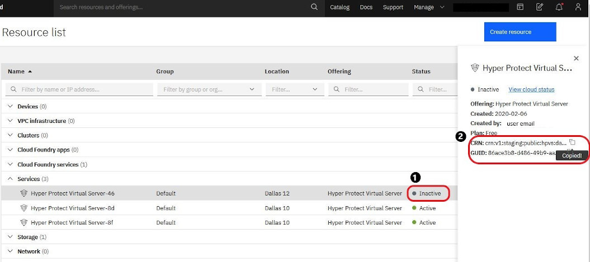

---

copyright:
  years: 2019
lastupdated: "2019-08-16"

subcollection: hp-virtual-servers

---

{:external: target="_blank" .external}
{:shortdesc: .shortdesc}
{:screen: .screen}
{:codeblock: .codeblock}
{:note: .note}
{:important: .important}
{:tip: .tip}
{:pre: .pre}

# Getting support
{: #support}

If you have problems or questions when using {{site.data.keyword.hpvs}}, you can check the {{site.data.keyword.cloud_notm}} status, or you can search for information or ask questions in a forum. You can also open a support ticket.
{:shortdesc}

- You can check the {{site.data.keyword.cloud_notm}} availability on the [status page](https://cloud.ibm.com/status?selected=status){: external}.

- You can review the forums to see whether other users ran into the same problem.
  - If you have technical questions about {{site.data.keyword.hpvs}}, post your question on
    [Stack Overflow](https://stackoverflow.com/questions/tagged/ibm-cloud){: external}.
  - For questions about the service and getting started instructions, use the
    [IBM developerWorks dW Answers](https://developer.ibm.com/answers/topics/ibm-cloud/){: external} forum.

  In both cases, tag your question with **HP-VS** so that the {{site.data.keyword.hpvs}} team can notice it.
  {:note}   

- If your problem still exists, open an {{site.data.keyword.IBM_notm}} support case (ticket).
  Include the cloud resource name (CRN) of your virtual server instance into the description of your issue.
  You retrieve this CRN from your server entry in the **Resource list** (see [Retrieving virtual server information](/docs/services/hp-virtual-servers?topic=hp-virtual-servers-retrieve-info-vs)). Click on any of the columns (except **Name** or **Tags**) to display a view from where you copy the CRN into the clipboard, as shown:

  

  *Figure 1. Retrieving the cloud resource name (CRN)*

For more information about {{site.data.keyword.IBM_notm}} support cases, or about support levels and severities, and for information about how to use the forums, access the Support Center:
[Contacting support](https://cloud.ibm.com/docs/get-support?topic=get-support-getting-customer-support){: external}.
