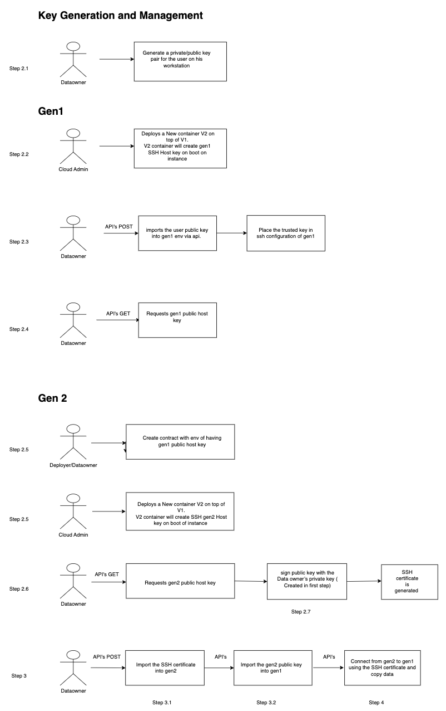

---

copyright:
  years: 2023, 2024
lastupdated: "2024-04-29"

subcollection: hp-virtual-servers

keywords: virtual server instance, instance, migrating, migration, virtual server

---

{{site.data.keyword.attribute-definition-list}}


# Migrating scenarios
{: #migrating}


{{site.data.keyword.cloud_notm}} {{site.data.keyword.hpvs}} for VPC is based on the [IBM Secure Execution for Linux](https://www.ibm.com/docs/en/linux-on-systems?topic=virtualization-introducing-secure-execution-linux){: external} technology and provided as a compute option in [IBM Virtual Private Cloud (VPC)](https://www.ibm.com/topics/vpc){: external}. By migrating your existing workload to IBM Cloud Hyper Protect Virtual Server instances on VPC, you can make full use of scalable isolation of workloads with hardware-based Secure Execution technoglogy and the flexibility of the VPC architecture. For more information, see [Why migrate?](/docs/hp-virtual-servers?topic=hp-virtual-servers-why-migrate).


Depending on how you provision and deploy your workloads in the IBM Cloud Hyper Protect Virtual Server instance, you can refer to the following migration guide in order to deploy the same workloads to the Hyper Protect Virtual Server instance in VPC. 

In the following context, the `classic instance` refers to the current IBM Cloud Hyper Protect Virtual Server instance that has your workloads, and the `VPC instance` refers to the IBM Cloud Hyper Protect Virtual Server instance on VPC that you will migrate to. 
{: note}

- [Migrating scenarios](#migrating-scenarios)
  - [The classic instance provisioned by using an IBM-provided image](#the-classic-instance-provisioned-by-using-an-ibm-provided-image)
  - [The classic instance provisioned by using your own image that does need data migration](#the-classic-instance-provisioned-by-using-your-own-image-that-does-need-data-migration)
  - [The classic instance provisioned by using your own image that has database workloads](#the-classic-instance-provisioned-by-using-your-own-image-that-has-database-workloads)
  - [The classic instance provisioned by using your own image that requires data migration and support data export or import feature](#the-classic-instance-provisioned-by-using-your-own-image-that-requires-data-migration-and-support-data-export-or-import-feature)
  - [The classic instance provisioned by using your own image that requires data migration and does not have ssh access](#the-classic-instance-provisioned-by-using-your-own-image-that-requires-data-migration-and-does-not-have-ssh-access)

## The classic instance provisioned by using an IBM-provided image
{: #hpvs_instance}

You provisioned a classic instance by using an IBM-provided image, use the `/data` folder on the instance to store any data, and you also have the private and public SSH key pair that are used to log in to the instance. 

To migrate all your data and workloads to the VPC instance, complete the following steps:

1. Ensure the migration is done in a maintenance window. For more information, see [{{site.data.keyword.cloud}} Service Description](https://www-03.ibm.com/software/sla/sladb.nsf/pdf/6605-17/$file/i126-6605-17_06-2019_en_US.pdf){: external}.

2. Prepare a Ubuntu 20.04 container image by using the `docker pull ubuntu:20.04` command, and create the dockerfile for your workloads based on the Ubuntun 20.04 image.
    ```yaml
    FROM ubuntu:20.04
    ...

    ```
    {: codeblock}

3. Create the contract for your workloads. The contract is required to deploy the workloads to the VPC instance. For more information, see [About the contract](/docs/vpc?topic=vpc-about-contract_se#hpcr_contract).

   1. Pass the SSH public key that is used to deploy the workloads on the classic instance either in the `env` section of the contract or in the `dockerfile` of the container image.
      - In the `env` section of the contract:
          ```yaml
          env: |
            type: env
            ... 
            env: 
               "public-key" : "your public key"
            ...
          ```
         {: codeblock}
      
      - In the `dockerfile`:
          ```yaml
          ...
          ENV SSH_PUBLIC_KEY="ssh-rsa AAAA...Yro6PloQ..."
          ...
          ```
          {: codeblock}

    2. Create the `workload` section for the workloads accordingly, and note the path of the data volume. For example, `/mnt/data`.

4. Create the VPC instance by using the container image and its contract. For more information, see [Deploying a sample application on Hyper Protect Virtual Server for VPC](/docs/vpc?topic=vpc-financial-transaction-confidential-computing-on-hyper-protect-virtual-server-for-vpc). Note that the VPC instance must be accessible by using its floating IP and the same SSH private key that you used to access the classic instance.

5. Log in to the classic instance, and install the `rsync` on the instance.  
    ```sh
    apt-get update || apt-get install rsync
    ```
    {: pre}

6. Run the `rsync` command on the classic instance to copy all the files and folders from the classic instance to the VPC instance. Note that the `SSH_ENDPOINT` is the port for SSH connection to your workloads on the VPC instance.
    ```sh
    rsync -avz -e 'ssh -p <SSH_ENDPOINT> -i ./private_key.pem' /data root@<VPC_INSTANCE_FLOATING_IP>:/mnt/data
    ```
    {: pre}

7. Stop the workloads on the classic instance, and restart the VPC instance to check whether the workloads are running properly, and all your data exists.

8. If everything works on the VPC instance, you can delete the classic instance. 


## The classic instance provisioned by using your own image that does need data migration
{: #byoi_no_data}

You provisioned a classic instance by using your own image and registration file, and store the data on a persistent storage such as a block storage service. 

To migrate the workloads to the VPC instance, complete the following steps:

1. Create the contract for your workload. For more information, see [About the contract](/docs/vpc?topic=vpc-about-contract_se#hpcr_contract). 

    1. The registraton file must be provided as part of the `workload` section in the contract.
    2. The other environment variables must be provided as part of the `env` section in the contract. 

2. Create the VPC instance by using your workload and contract. For more information, see [Deploying a sample application on Hyper Protect Virtual Server for VPC](/docs/vpc?topic=vpc-financial-transaction-confidential-computing-on-hyper-protect-virtual-server-for-vpc&interface=ui). 

3. Check your workloads on the VPC instance are running properly, and all your data exists.

4. If everything works on the VPC instance, you can delete the classic instance. 

## The classic instance provisioned by using your own image that has database workloads
{: #byoi_db}

You provisioned a classic instance by using your own image and registration file, and your own image contains database workloads. Also, you have no SSH access to the classic instance.

If your database workloads support live migration, you can create the VPC instance as described in the [previous scenario](#byoi_no_data), and then use the live migration for the migration.
{: tip}

If your database workloads do not support live migration, complete the following steps to migrate the workloads to the VPC instance.

1. Update the classic instance to support `rsync` utility and connect to the VPC environment.

   1. Reserve a floating IP address in the VPC environment, and specify a port such as `873` for the `rsync` utility to connect to. For more information, see [Creating network interfaces with floating IP addresses](/docs/vpc?topic=vpc-fip-working) and [Updating a VPC's default security group rules](/docs/vpc?topic=vpc-updating-the-default-security-group). 

   2. Use the container image that the classic instance is provisioned as the parent image, update its dockerfile to install the `rsync` utility when the new container starts.  
      ```yaml
      FROM ImageName 
      ... 
      RUN apt-get install rsync ...
      ```
      {: codeblock}

   3. Update the `rsync.conf` file with the reserved floating IP address and the password file that is used by the `rsync` utility. 
      ```
      ...
      Uid = root
      gid = root
      use chroot = yes
      max connections = 1
      timeout = 300
      pid file = /data/rsyncd.pid
      lock file = /data/rsync.lock
      log file = /data/rsyncd.log
      read only = false
      list = false
      hosts allow = <floating_ip>
      hosts deny = 0.0.0.0/32
      auth users = rsync_backup
      secrets file = /data/rsync.password
      ...
      ```
      {: codeblock}

   4. Create a repo registration file for the new container image by allowlisting the floating IP address and the password file. For more information, see [Creating a registration definition file by using the CLI](/docs/hp-virtual-servers?topic=hp-virtual-servers-byoi).

   5. Update the classic instance with the new container image and its repo registration file. For more information, see [Updating a virtual server](/docs/hp-virtual-servers?topic=hp-virtual-servers-update_vs#update_ownimage).

2. Create a VPC instance by using the updated container image and migrate the data to persistent storage such as a block storage service. 

   1. Use the container image that the classic instance is provisioned as the parent image, update its dockerfile to install and execute the `rsync` client when the new container starts. Note that the `$PASSWD` is the same password used by the `rsync` utility in the classic instance, and `$CLASSIC_INSTANCE_IP` is the IP address of the classic instance.
      ```yaml
      FROM ImageName 
      ... 
      RUN apt-get install update && \
          apt-get install rsync -y && \
          echo "$PASSWD" > /data/rsync_passwd && \
          chmod 600 /data/rsync_passwd && \
          rsync -avz -P rsync_backup@$CLASSIC_INSTANCE_IP::backup /data --password-file=/data/rsync_passwd
      ...
      ```
      {: codeblock}

   2. Create the contract for the new container image. For more information, see [About the contract](/docs/vpc?topic=vpc-about-contract_se#hpcr_contract). 
      
      1. Pass the IP address of the classic instance and the password key file by the `rsync` utility in the `env` section of the contract. 
           ```yaml
           env: |
            type: env
            ... 
            env: 
               "CLASSIC_INSTANCE_IP" : "CLASSIC_INSTANCE_IP"
               "PASSWD" : "<rsync_password>
            ...
           ```
           {: codeblock}

      2. Pass the registraton file as part of the `workload` section in the contract.

   3. Create the VPC instance by using the new container image and its contract, attach a block storage as its data disk, and assign the floating IP address to the VPC instance.

   4. Check the logs of the VPC instance to ensure the data synchronation is completed successfully.

   5. Delete this VPC instance without deleting the data disk. 

3. Create another VPC instance with the container image that is used to provision the classic instance, and attach the data disk to the VPC instance.

   1. Create the contract for the container image. For more information, see [About the contract](/docs/vpc?topic=vpc-about-contract_se#hpcr_contract). 
      1. The repo registration file of the container image must be passed into the `workload` section of the contract.
      2. Other environment variables required for the container image must be passed into the `env` section of the contract.

   2. Create the VPC instance by using the container image and its contract.

   3. Attach the data disk to the VPC instance.

4. Check your workloads on the VPC instance are running properly, and all your data exists.

5. If everything works on the VPC instance, you can delete the classic instance. 


## The classic instance provisioned by using your own image that requires data migration and support data export or import feature
{: #byoi_dataex}

You provisioned a classic instance by using your own image and registration file, and you can access to the classic instance in a secure manner such as `ssh`. Meanwhile, you can update your workloads to support data export and import features when the instance is running.

The export and import features must be supported via REST APIs on the classic or VPC instance, therefore, the source code of your container image must be updated and built to support such features. If a secret is required during the build time, the secret must be recognized by such APIs.
{: note}

The following diagram shows the workflow and tasks of each role in this scenario.

{: caption="Figure 1. Migrating by adding export and import APIs" caption-side="bottom"}


To migrate all your data and workloads to the VPC instance, complete the following steps:

1. Update the workloads on the classic instance to export the data to be migrated.

   1. Update the source code of the container image that is used to provision the classic image, and add the export and import REST APIs with the following requirements.
      - Export REST API: 
          - The API can recognize the secrets to be using for running the workloads.
          - The API can generate an archive `.tar` file to include all the data and files with the path information.
          - The API can encrypt the `tar` file by using the secrets during the container image's build time and at the workloads run time.
      - Import REST API:
          - The API can recognize the secrets to be using for running the workloads and building the container image.
          - The API can decrypt an archive `tar` file by using the secrets during the container image's build time and at the workloads run time.
          - The API can extract the decrypted data or files to respective paths.

   2. Update the classic instance with the new container image and its repo registration file. For more information, see [Updating a virtual server](/docs/hp-virtual-servers?topic=hp-virtual-servers-update_vs#update_ownimage).

   3. Invoke the export API or feature to generate the `.tar` file, and save the file to the local filesystem. 

2. Create a VPC instance by using the updated container image, attach a persistent storage as its data volume, and import the data. 

   1. Create the contract for the updated container image that supports import and export features. The `workload` section and `env` section might be from different roles depending how you design the development and deployment process in the VPC environment. For more information, see [About the contract](/docs/vpc?topic=vpc-about-contract_se#hpcr_contract). 

   2. Deploy the updated ontainer image with its contract to the VPC instance. Note that you need to attach a data disk such as block storage to the VPC instance, and you can access the workloads on the VPC instance once it's started.

   3. Invoke the import API or feature to upload the `.tar` file, and extract the data and files to the respective paths on the data disk.
   
   4. Delete this VPC instance without deleting the data disk. 

3. Create another VPC instance with the container image that is used to provision the classic instance, and attach the data disk to the VPC instance.

   1. Create the contract for the container image. For more information, see [About the contract](/docs/vpc?topic=vpc-about-contract_se#hpcr_contract). 
      1. The repo registration file of the container image must be passed into the `workload` section of the contract.
      2. Other environment variables required for the container image must be passed into the `env` section of the contract.

   2. Create the VPC instance by using the container image and its contract.

   3. Attach the data disk to the VPC instance.

4. Check your workloads on the VPC instance are running properly, and all your data exists.

5. If everything works on the VPC instance, you can delete the classic instance. 

## The classic instance provisioned by using your own image that requires data migration and does not have ssh access
{: #byoi_dataex_ssh}

You provisioned a classic instance by using your own image and registration file, and you can access to the classic instance in a secure manner such as `ssh`. 

The following diagram shows the workflow and tasks of each role in this scenario.

{: caption="Figure 1. Migrating by not having ssh access" caption-side="bottom"}


To migrate all your data and workloads to the VPC instance but without having ssh access, complete the following steps:

1. Ensure `SSH` and `rsync` packages are installed on top of workload container. 
2. Update the workloads on the classic instance to install this package on workload container of gen1 and gen2.
3. Establish a secure communication channel between the servers.
4. Generate a strong `RSA` key pair using the `ssh-keygen` command.
   
   **Note**: This pair consists of a private key (user_key) and a corresponding public key (user_key.pub). The private key should be kept confidential, while the public key will be shared with the servers.   
5. Generate `SSH` host key on gen 1.
   - Ensure secure and unique host identification for gen1 server. 
   - In the update workload Dockerfile of gen1, integrate `SSH` host key generation using `ssh-keygen`
6.	Import Data Owner's Public Key to gen1.
   - Establish trust between the data owner and gen1 and verify the authenticity during SSH connections.   
7. Import the data owner's public key into gen1 using workload API's.
   - Get gen1 Public Host Key.
   - Create an API to retrieve the public host key of gen1 and use this key for verification by other servers connecting to gen1.
8. Generate SSH Key on gen2 and import gen1 Public Key into gen2 through contract. For more information, see [About the contract](/docs/vpc?topic=vpc-about-contract_se#hpcr_contract).    
   **Note**: In the update workload Dockerfile of gen2, similar to gen1, gen2 generates its SSH key pair using the ssh-keygen command and import Gen1's public key into gen1 using env variable in contract and copied to known_host file from env file.
   ```
      "public-key" : "data-owner-public-key"
   ```
9.	Get gen2 Public Host Key.
   - Create an API to retrieve the public host key of gen2 and use this key for verification by other servers connecting to gen1.
10. Sign gen2 Public Key with Data Owner's Private Key
    An API facilitates the signing of gen2's public key with the data owner's private key. This creates an SSH certificate `gen2_key-cert.pub` for gen2, signed by the data owner.
11. Import Keys and Certificates.
    - Import SSH Certificate into gen2 using `API~/.ssh/ directory` of gen2.   
   **Note**: This ensures that gen2 can present its signed certificate during authentication.
    - Import gen2 Public Key as Trusted Key for SSH Certificates into gen1.
    An API is responsible for importing gen2's public key into gen1's `authorized_keys` file. This establishes gen2 as a trusted entity for SSH connections.
12. Configure the connection and perform data migration.
    - Connect from gen2 to gen1 using the SSH certificate `gen2_key-cert.pub` and pin the remote host key to the gen1 public key.
   **Note**: This configured connection verifies the host key against gen1's public host key.
    - Migrate data using rsync.
         ```
               rsync -e "ssh -i /etc/ssh/ssh_host_rsa_key -o 'CertificateFile=/root/.ssh/gen2_key-cert.pub' -o 'UserKnownHostsFile=/root/.ssh/known_hosts' -o 'VerifyHostKeyDNS yes' -o StrictHostKeyChecking=yes" -avz root@source-ip:/root/temp/temp.data /root/
         ```


