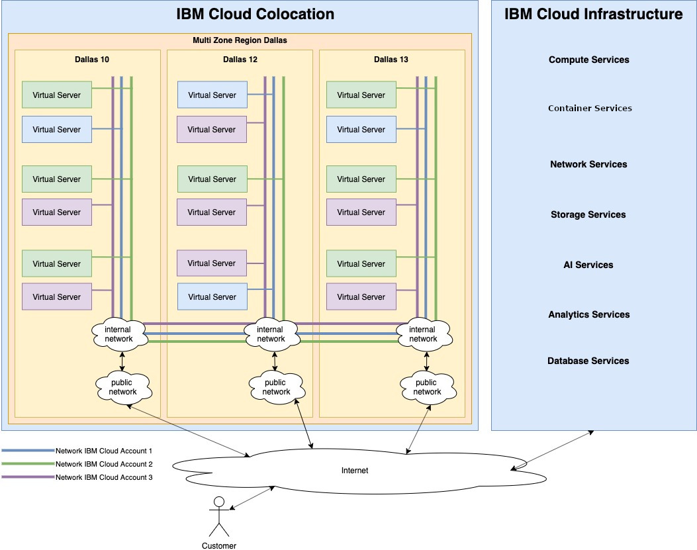

---

copyright:
  years: 2019
lastupdated: "2019-12-12"

---

{:external: target="_blank" .external}
{:shortdesc: .shortdesc}
{:screen: .screen}
{:codeblock: .codeblock}
{:note: .note}
{:important: .important}
{:tip: .tip}
{:pre: .pre}

# The {{site.data.keyword.hpvs}} network architecture
{: #net_architecture}

The IBM LinuxONE infrastructure components for the {{site.data.keyword.hpvs}} service are situated in colocation with the data centers.
That means, these components are placed in the same data centers as the {{site.data.keyword.cloud}} infrastructure but
have their own network setup. This has some effects on how you should connect to your Virtual Server.

- You must use the public route if you want to connect between any other service and a virtual server instance created with {{site.data.keyword.hpvs}}.
  Use a VPN connection for this purpose.
- Mapping of the public to the internal IP address is done on all ports. Make sure to only open the ports on your virtual server that you
  want to have exposed to the public network.
- When you connect from one virtual server to another in the same region, do this via the internal network (therefore using the internal IP address).
- The traffic on the internal network is automatically isolated from other tenants.

Read [Protecting a virtual server](/docs/services/hp-virtual-servers?topic=hp-virtual-servers-protect_vs) for details about which
firewall is pre-configured for your virtual server and how it is configured.

*Figure 1. **{{site.data.keyword.hpvs}}** network architecture*
