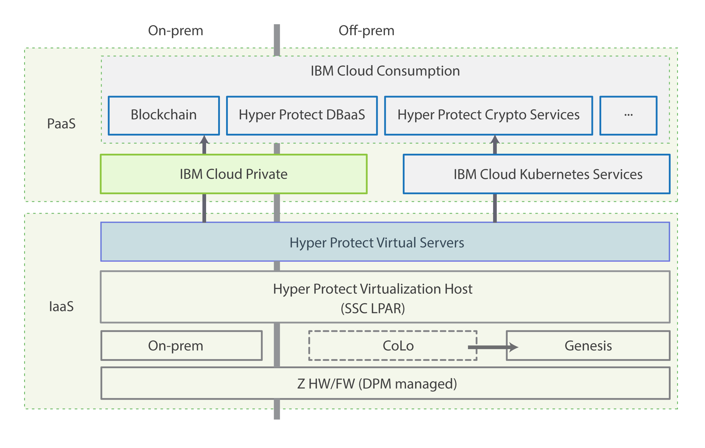

---

copyright:
  years: 2019
lastupdated: "2019-01-31"

---

{:new_window: target="_blank"}
{:shortdesc: .shortdesc}
{:screen: .screen}
{:codeblock: .codeblock}
{:note: .note}
{:important: .important}
{:tip: .tip}
{:pre: .pre}

# {{site.data.keyword.cloud_notm}} Hyper Protect Virtual Servers overview
{: #hp-virtual-servers-overview}

{{site.data.keyword.cloud}} Hyper Protect Virtual Servers is in the **Experimental** phase and is for tryout and test purpose only. You need to sign-up via the [Hyper Protect info page](https://www.ibm.com/cloud/hyper-protect-services){:new_window} and request to be added to the entitlement list before you can see this service in the Cloud Experimental catalog. The virtual server that you create with Hyper Protect Virtual Servers will be deleted after 30 days. To prevent data loss, use only test data in the current service. This restriction also applies to using Hyper Protect Virtual Servers with other {{site.data.keyword.cloud_notm}} services.
{:important}

{{site.data.keyword.cloud_notm}} Hyper Protect Virtual Servers is an {{site.data.keyword.cloud_notm}} service that provides highly secure virtual servers that can run Linux and Docker workloads on demand. It offers a flexible and scalable platform that allows you to quickly and easily provision and manage the virtual server of your choice, which allows for a range of capacity sizes to meet various demands of applications that run in the server.
{:shortdesc}

## Why Hyper Protect Virtual Servers  
{: #hp-virtual-servers-benefits}

The following summarize the benefits of using Hyper Protect Virtual Servers:

- **Security**
  By using Hyper Protect Virtual Servers, you can deploy a virtual server in a **Secure Service Container**, which ensures confidentiality of your data and code that you run within the virtual server. No external access is allowed, including privileged users such as cloud administrators, to your data.

- **{{site.data.keyword.IBM_notm}} Z capabilities on the cloud**
  Hyper Protect Virtual Servers bring IBM Z capabilities on the cloud, which enables you to deploy workload into the most secure, highly performant Linux virtual server with extreme vertical scale.

- **Easy to use, open, and flexible**
  Embracing the openness and flexibility of a public cloud, Hyper Protect Virtual Servers offers user experience at parity with market leaders both when buying and using the virtual machine.

-  **No IBM Z skills required**
  By deploying Hyper Protect Virtual Servers, you are able to access Z technology without having to purchase, install, and maintain unique hardware.

## How Hyper Protect Virtual Servers works
{: #hp-virtual-servers-how-it-works}

The following architectural diagram shows how Hyper Protect Virtual Servers works.

*Figure 1. Hyper Protect Virtual Servers architecture diagram*  

## Key features
{: #hp-virtual-servers-key-features}

{{site.data.keyword.cloud_notm}} Hyper Protect Virtual Servers makes it possible to bring {{site.data.keyword.IBM_notm}} Z into {{site.data.keyword.IBM_notm}}’s global public cloud data centers. Through the {{site.data.keyword.cloud_notm}} catalog, you can gain easy access to industry-leading security capabilities to modernize their applications in the {{site.data.keyword.cloud_notm}}. This includes:

- Run both core and non-core workloads in a public cloud setting with all security and compliance readiness of on-premise, protecting the assets of business while maintaining enhanced business service levels.
- Instantiate Linux virtual servers with your own public SSH key, and be the only one to access code and data, not even IBM has access to data.
- Deploy any supported workload into the most secure, highly performant Linux machine with extreme vertical scale, taking advantage of strengths of LinuxONE platform.

## Roles and responsibilities

The following table shows the roles that Hyper Protect Virtual Servers supports.

| Roles | Responsibilities |
|-------|------------------|
| Solution and software architect | Design the architecture of the entire solution and software. The architect must ensure SLA while keeping flexibility, vendor prevention, and integration with existing service ecosystem. |
| Application developer | Develop and roll out applications on a reliable platform while keeping data safe. |

*Table 1. Roles and responsibilities*
