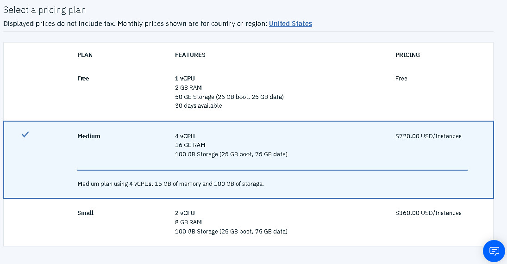
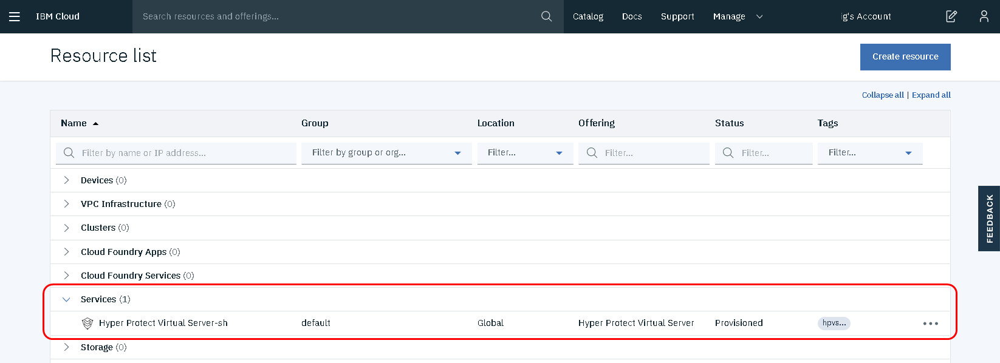

---

copyright:
  years: 2019, 2020, 2021
lastupdated: "2021-02-26"

subcollection: hp-virtual-servers

---

{:external: target="_blank" .external}
{:shortdesc: .shortdesc}
{:screen: .screen}
{:codeblock: .codeblock}
{:note: .note}
{:important: .important}
{:tip: .tip}
{:pre: .pre}


# Provisioning a virtual server
{: #provision}


You can use the {{site.data.keyword.hpvs}} service to create a virtual server from the {{site.data.keyword.cloud_notm}} UI or from the CLI.
{:shortdesc}

You can use an IBM-provided image or your own image to provision a server.

Use the CLI to provision a server if you want to:
- [Use your own image](https://cloud.ibm.com/docs/hp-virtual-servers?topic=hp-virtual-servers-byoi). You need to create an image file and registration definition file as described [here](https://cloud.ibm.com/docs/hp-virtual-servers?topic=hp-virtual-servers-byoi).
-  [Create servers](https://cloud.ibm.com/docs/hp-virtual-servers?topic=hpvs-cli-plugin-hpvs_cli_plugin#create_instance) without a public inbound address.

{:note}
Do not use personal information, for example, your name, as the instance name or as part of the instance name. The data that you provide when you provision an instance or interact with the hpvs cli is not considered to be personal data or credentials.
Learn more about IBM Cloud Hyper Protect Virtual Servers' Data usage and Certifications [here](https://www.ibm.com/software/reports/compatibility/clarity-reports/report/html/softwareReqsForProduct?deliverableId=165C6EF0FFDA11E8BABD512A6952EE1F).

{:note}
The Ubuntu servers are preconfigured in such a way that the passwords expire after 90 days. After the user password expires, you have 30 days to change your password. If you don't change your password within the 30 days, your account becomes inactive and it is no longer possible to log in via SSH even if you are using SSH-keys. For more information, see [Protecting a virtual server](https://cloud.ibm.com/docs/hp-virtual-servers?topic=hp-virtual-servers-protect_vs).

{:note}
As soon as you create a virtual server instance, a virtual LAN (VLAN) is transparently created or assigned. One VLAN is used within one region for one account. Each VLAN can contain up to five virtual servers per data center. A VLAN is deleted as soon as you delete the last virtual server instance that is assigned to this VLAN.

## Creating a virtual server in the UI
{: #provision-ui}

1. [Log in to your {{site.data.keyword.cloud_notm}} account](https://cloud.ibm.com){: external}.
2. Click **Catalog** from the menu bar, then browse for the **Compute** category.
3. In the displayed selection of services, look for the **{{site.data.keyword.hpvs}}** tile. If you don't see the tile, enter `virtual server` in the search field. Then, click the tile. The {{site.data.keyword.hpvs}} page opens.

*Figure 1. Creating a virtual server*
4. In section **Select a region**, you can select the data center in which to create the virtual server instance, or you can accept the preselected default data center.
5. The **Service name** field offers a name proposal for your virtual server. You can change this name according to your conventions.
6. In the **Tags** field, you can optionally add tags to organize your resources.
7. Enter your SSH public key into the **SSH public key** field. For more information about SSH keys, see [Generating SSH keys](/docs/services/hp-virtual-servers?topic=hp-virtual-servers-generate_ssh). You can enter the public key with or without the comment. The comment is either automatically generated by the SSH key generation command, or you can optionally overwrite it. The auto-generated comment contains person-related information. That's why any comment is removed as the first step during virtual server provisioning.
8. Select one of the available pricing plans. For initial tests, select the **Free** plan. With this plan, you can have a maximum of two virtual servers at the same time (excluding expired servers). Selecting a different plan leads to fees charged by IBM.   

*Figure 2. Available pricing plans*  

9. Click **Create** to provision a virtual server instance.


The virtual server instance appears in the **Resource list**. Use your browser's refresh function to check whether the instance's status has switched from **Inactive** (the server is being provisioned) to **Active** (the server is provisioned).  Because of the configuration process, provisioning can take from 5 - 30 minutes.
When your instance has a status of **Active** (provisioned), click the instance in the **Name** field to open the dashboard.
If the configuration fails, the instance status stays as **Inactive**, and if you click the instance in the **Name** field, an error message is displayed.



*Figure 3. Resource list with a virtual server that shows one server that is being provisioned (**Inactive**) and one server that is already provisioned (Active)*

## Creating a virtual server from the CLI
{: #provision-cli}

To create a virtual server from the CLI, you must first install the [CLI](https://cloud.ibm.com/docs/hpvs-cli-plugin), then then run the following command:

```
ibmcloud hpvs instance-create NAME PLAN LOCATION [(--ssh SSH-KEY | --ssh-path SSH-KEY-PATH)] [(--rd REGISTRATION-DEFINITION | --rd-path REGISTRATION-DEFINITION-PATH)] [-i IMAGE-TAG] [-e ENV-CONFIG1 -e ENV-CONFIG2 ...] [-g RESOURCE-GROUP-ID] [-t TAG1 -t TAG2 ...] [--outbound-only]
```
{: codeblock}


Where:
<dl>
<dt>`NAME`</dt>
<dd>Is the name of your new instance.</dd>
<dt>`PLAN`</dt>
<dd>Is the name or ID of your service plan, for example, the plan name for a free plan is `lite-s`. The possible values for plan name are: `lite-s`, `entry`, `small`, and `medium`.</dd>
<dt>`LOCATION`</dt>
<dd>Is the target location to create the service instance. The possible values are: `dal10`, `dal12`, `dal13`, `fra02`, `fra04`, `fra05`, `syd01`, `syd04`, `syd05`, `wdc04`, `wdc06`, `wdc07`.</dd>
</dl>

### Command options
<dl>
<dt>`--ssh SSH-KEY` </dt>
<dd>Public half of the SSH key to access the virtual server later. `--ssh` or `--ssh-path` is required when you use an IBM-provided image.</dd>
<dt>`--ssh-path SSH-KEY-PATH` </dt>
<dd>File path to the file that contains the public half of the SSH key to access the virtual server later. `--ssh` or `--ssh-path` is required when you use an IBM-provided image.</dd>
<dt>`--rd REGISTRATION-DEFINITION`</dt>
<dd>The encrypted and signed registration definition that is used for [Bring your own server image (BYOI)](https://cloud.ibm.com/docs/hp-virtual-servers?topic=hp-virtual-servers-byoi). `--rd` or `--rd-path` is required when you use a self-provided image.</dd>
<dt>`--rd-path REGISTRATION-DEFINITION-PATH`</dt>
<dd>File path to the file containing the encrypted and signed registration definition that is used for BYOI. `--rd` or `--rd-path` is required when you use a self-provided image.</dd>
<dt>`-i IMAGE-TAG`</dt>
<dd>The image tag for the BYOI server image. Required if you use your own image.</dd>
<dt>`-g RESOURCE-GROUP-ID | RESOURCE-GROUP-NAME` </dt>
<dd>The resource group to which your {{site.data.keyword.hpvs}} instance belongs for access control and billing purposes, for example, `Default`. To list all of your resource groups, run `ibmcloud resource groups`. Optional.</dd>
<dt>`-t TAG` </dt>
<dd>Use tags to organize your resources. Tags are visible account-wide. Optional. Multiple tags are permitted, for example, `-t tag1 -t tag2`.</dd>
<dt>`-e ENV-CONFIG`</dt>
<dd>Specify environment variables if you are using a self-provided image. You must specify the variables in your registration definition first. You can set one or more environment variables as key value pairs by using the `-e` flag, for example, `-ibmcloud hpvs instance-update CRN -i latest -e k1=v1 -e k2='v2 v3'`. Environment variable `names` can have a maximum length of 64 characters and can be numbers, chars and underscore. Environment variable `values` can have a maximum length of 4096.
</dd>
<dt>`--outbound-only`</dt>
<dd>If this parameter is set, only outbound connections are allowed from your Hyper Protect Virtual Server instance. Use the internal IP address to connect to this Virtual Server from other Virtual Servers created by the same {{site.data.keyword.cloud_notm}} account in the same region.</dd>
</dl>

For example:
```
ibmcloud hpvs instance-create MyHPVS lite-s dal13 -g Default -p "{\"sshPublicKey\": \"ssh-rsa AAAAB3NzaC1yc2EAAAADAQABAAABgQCgguQtzV39LpP/iHAtjwo+4Z5QdASG73dwBlFIsTn5kPOaVYFHhzhvA/xMbLqDpxfYP/YzwU4rXNXMhCr4hlsruPXt5Ak4y83GmnNL8e+oq8lxU/afymje4PcYLnkm8WQvkreIEBaB73VOUKiLSSbdVljUk6a1LB347bCf72Oob8JpY4Pb3N4idrigSoCc+V4JVkz4pXD2Hoyar4J5I2527Ho+vUqdf5FoK9mFRUqtI8NTLKynL2/qVsCgTeUxnOknDjPE0+nqwyNI4toYozcISYb63K9Je6UBT4JaIQXMbdMhDH00wVH7R26SamKqS2iazcUBnZgN4//Vnic+US90ybsqvTuP/OQpHXwfdjshOEsz5PULZKbWgidsfA7aW3pjv1uijCPIrTFOsaAPktMCzhfJzaeFC0VIXweN7/2PT/Zl7U9Ys36CmmLaXfLotXxPWmbGUyRfavPN1Znhqph7v9w94E7JcngQ7sn+l+nkpYg5qdcBFZZ3kNhT4PVRbXE=\"}"

```
{: codeblock}

You can find more information about the create command [here](https://cloud.ibm.com/docs/hpvs-cli-plugin?topic=hpvs-cli-plugin-hpvs_cli_plugin#create_instance){: external}.

The newly created instance is marked as `provisioning` until provisioning completes. Use the `ibmcloud hpvs instance <CRN>` [command](https://cloud.ibm.com/docs/hpvs-cli-plugin#details_list) to list your new instance and check its current state. After provisioning has completed, the instance is marked as active.

## Billing information
{: #billing}

When you create virtual servers by selecting a priced plan, IBM bills you monthly for each instance. IBM does not take into account how long an instance exists within one month. If you delete a virtual server before the end of a month, IBM charges the fee for the complete month and then automatically stops the billing.  

 For example, if you create three instances with the Medium plan on 1 February 2020, and delete all instances on 15 May 2020, you're charged with 4 x 3 x 720,00 USD = 8.640,00 USD.

 ## Free plan
 Virtual servers that are created with the **Free** plan are automatically deleted after 30 days without warning. That's why you must back up important data regularly. Deleted **Free** instances aren't removed from the **Resource list**. You must delete them manually.
