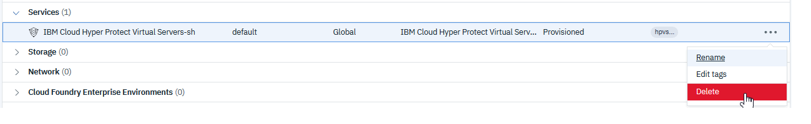

---

copyright:
  years: 2019, 2020
lastupdated: "2020-07-15"

subcollection: hp-virtual-servers

keywords: deleting virtual server, resource reclamations
---

{:external: target="_blank" .external}
{:shortdesc: .shortdesc}
{:screen: .screen}
{:codeblock: .codeblock}
{:note: .note}
{:important: .important}
{:tip: .tip}
{:pre: .pre}

# Deleting a virtual server
{: #remove_vs}

You can use the {{site.data.keyword.hpvs}} UI or the CLI to delete virtual servers. Deleted servers that belong to paid plans can also be restored before the reclamation period expires.
{:shortdesc}

## Deleting a virtual server in the UI

1. Go to the [Resource list](https://cloud.ibm.com/resources){: external} (see [Retrieving virtual server information](/docs/services/hp-virtual-servers?topic=hp-virtual-servers-retrieve-info-vs)) to delete a virtual server.
2. Select the instance from the **Services** list and apply the **Delete** from its action list.



*Figure 1. Deleting a virtual server instance*

## Deleting a virtual server from the CLI

To delete {{site.data.keyword.hpvs}} from the [CLI](https://cloud.ibm.com/docs/hpvs-cli-plugin):

1. Make sure you know the Cloud resource name (CRN) of the server you want to delete. To find the CRN, run:

```
ibmcloud hpvs instances
```
{:pre}

2. To delete the server, run the following command:

```
ibmcloud hpvs instance-delete CRN --force
```
{:pre}
Where `CRN` is Cloud resource name of the server you want to delete. Use `--force` to force the deletion of the {{site.data.keyword.hpvs}} instance without showing a confirmation prompt.


You can find more information and example output [here](https://cloud.ibm.com/docs/hpvs-cli-plugin#hpvs-instance-delete).

## What happens during the reclamation period
When you delete a virtual server from the resource list, the server isn't deleted immediately, it's stopped and marked for deletion, and a reclamation period of seven days starts. The server is deleted after the reclamation period ends. During this seven-day reclamation period, you can restore the virtual server, or manually trigger a deletion from [resource reclamations](https://cloud.ibm.com/docs/cli?topic=cli-ibmcloud_commands_resource#ibmcloud_resource_reclamations){: external}. Resource reclamations lists the  {{site.data.keyword.hpvs}} that are marked for deletion together with the time (Target time) when the actual deletion is triggered.

## Deleting servers that belong to the free plan
The free plan servers expire 30 days after they are created. When a server expires, it's immediately deleted at the backend. The server is also deleted at the backend if it expires during the seven-day reclamation period. Even though the server is deleted at the backend, it's still displayed in the resource list or in the resource reclamations as if it still exists.
If the server has expired, you can remove the entry from the resource list and either:
- Wait for the target time to trigger deletion for you, or
- Manually trigger the deletion from the resource reclamations.
If an expired server is restored, only the entry within the resource list is restored, not the server itself.

## Restoring servers that belong to paid plans
Servers that belong to a paid plans do not expire, and that's why they can be restored during the reclamation period. If a server is restored, the timeframe for which the server was within the resource reclamations is billed to your account.

After the server is deleted, only metadata, which isn't considered to be personal data is kept for 6 months.
Make sure you back up important data for future use because you can't recover data after the virtual server has been deleted.
{:important}
