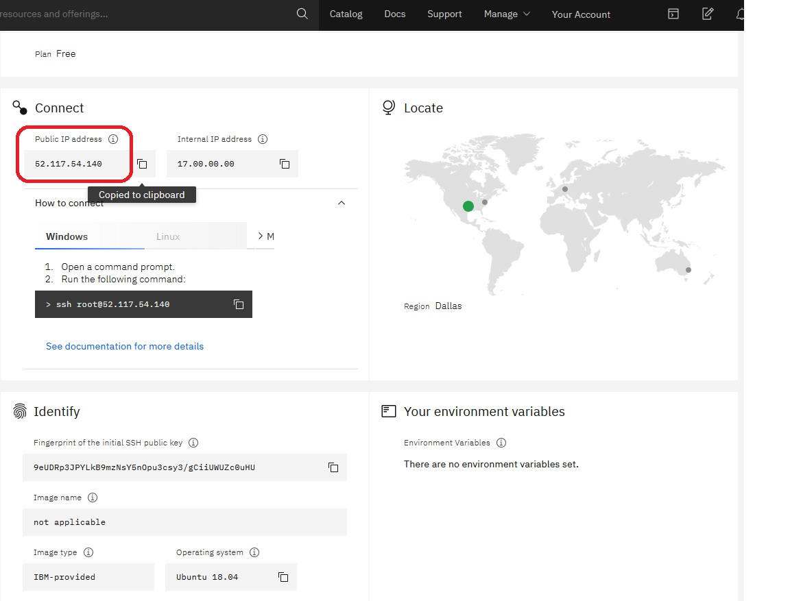

---

copyright:
  years: 2019, 2020
lastupdated: "2020-07-14"

subcollection: hp-virtual-servers

---

{:external: target="_blank" .external}
{:shortdesc: .shortdesc}
{:screen: .screen}
{:codeblock: .codeblock}
{:note: .note}
{:important: .important}
{:tip: .tip}
{:pre: .pre}

# Retrieving information about a virtual server
{: #retrieve-info-vs}

After you create a virtual server instance by using the {{site.data.keyword.hpvs}} service, you can view detailed information about your new instance.
{: shortdesc}

{:note}
The Ubuntu servers are preconfigured in such a way that the passwords expire after 90 days. After the user password expires, you have 30 days to change your password. If you don't change your password within the 30 days, your account becomes inactive and it is no longer possible to log in via SSH even if you are using SSH-keys. For more information, see [Protecting a virtual server](https://cloud.ibm.com/docs/hp-virtual-servers?topic=hp-virtual-servers-protect_vs).

## Retrieving information in the UI
{: #retrieve-UI}

1. Go to the [Resource list](https://cloud.ibm.com/resources){: external} and look for your virtual server instance under the **Services** entry in the **Name** column.
2. Select **View resources** within the **Resource summary** area to open the **Resource list** either from the {{site.data.keyword.cloud_notm}} **Navigation Menu**, or from the {{site.data.keyword.cloud_notm}} dashboard. The **Locate** map shows you in which region your instance was created, and the column **Location** displays the data center where your instance was created. Use the filter to search for virtual server instances in certain regions or data centers. See also Figure 2 from [Provisioning a virtual server](/docs/services/hp-virtual-servers?topic=hp-virtual-servers-provision).
2. Click your virtual server instance to open the **{{site.data.keyword.hpvs}} dashboard**.

In this dashboard, you can find the public IP address, which you use to connect to the virtual server.
You must use the internal IP address when you connect to a virtual server from another virtual server, which is in the same virtual LAN (VLAN). VLANs span across all data centers within their region.

You must also work with the internal IP addresses, when you connect to other {{site.data.keyword.cloud_notm}} Cloud services that are located within the same data center.


*Figure 1. **{{site.data.keyword.hpvs}}** dashboard*

In the **Connect** area, the dashboard offers a comfortable feature to log in to the virtual server:
1. Open **How to connect**.
2. Select your operating system from where to connect to your virtual server. The operating system that you currently work on, is preselected.
3. Copy the shown command into the clipboard.
4. Paste it into a command line or command prompt of your operating system.

This method works, if you produced the private key by using the default settings (file name and location).
It also works, if you configure your SSH client to automatically use the private key that corresponds to the virtual server's public key.

The dashboard also displays the fingerprint of the SSH public key, with which the virtual server was created.
This fingerprint is displayed with the `ssh-keygen` command when you generate a pair of SSH keys. Or you can reproduce the fingerprint of a public SSH key by entering a command similar to the following one:

```
ssh-keygen -E sha256 -lf id_rsa.pub
```
{: codeblock}

- Parameter `-E` specifies the hash algorithm that is used to produce the fingerprint.
- Parameter `-lf` specifies the file (name and location, if necessary) of the public SSH key half, which you want to check.

## Retrieving information from the CLI
{: #retrieve-cli}

To list all of your {{site.data.keyword.hpvs}} service instances in your resource list from the CLI, enter the following command:

```
ibmcloud hpvs instances
```

The output displays a list of details for each instance. If you have no instances, a no instance found message is displayed.

To display details about a server instance, you need the cloud resource name (CRN) for the server instance. To get the CRN, run  `ibmcloud hpvs service-instances`. Then run the following command:

```
ibmcloud hpvs instance CRN [--output json]
```
{: pre}

Where:
<dl>
<dt>`CRN`</dt>
<dd>Is the server's cloud resource name (CRN). </dd>
<dt>`--output`</dt>
<dd>Displays results as JSON. The only valid value is `json`</dd>
</dl>

{: codeblock}

You can find example output [here](https://cloud.ibm.com/docs/hpvs-cli-plugin#details_list).
