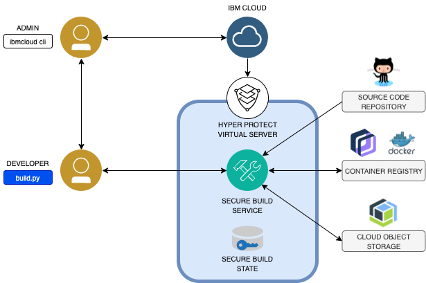

---

copyright:
  years: 2021
lastupdated: "2021-08-24"

subcollection: hp-virtual-servers

content-type: tutorial
services: hp-virtual-servers
account-plan: free
completion-time: 1h

keywords: secure build, secure build server, image, virtual server instance, instance, virtual server,  secure CI/CD, confidential computing, confidential computing build, confidential computing CI/CD
---

{:external: target="_blank" .external}
{:shortdesc: .shortdesc}
{:screen: .screen}
{:codeblock: .codeblock}
{:note: .note}
{:important: .important}
{:tip: .tip}
{:pre: .pre}


# Tutorial: Using Secure Build Server with a digital wallet
{: #tutorial_secure_build_server}
{: toc-content-type="tutorial"}
{: toc-services="hp-virtual-servers"}
{: toc-completion-time="1h"}

In this tutorial, you use the {{site.data.keyword.cloud}} {{site.data.keyword.hpvs}} Secure Build Server to build a digital wallet application, then you use {{site.data.keyword.hpvs}} to deploy the resulting application in the public cloud.

## Contents
- [Basic concepts](#basicconcept_sbs)
- [Digital wallets](#digwall_sbs)
- [Before you begin](#prerequisites_sbs)
- [Task flow](#taskflow_sbs)
- [Summary](#summary_sbs)
<!-- - [Next steps](#nextsteps_sbs) -->

## Secure Build Server basic concepts
{: #basicconcept_sbs}

You use the Secure Build Server to build a trusted container image within a secure enclave, which is provided by IBM Cloud {{site.data.keyword.hpvs}}. The enclave is highly isolated, which means that software developers must use a specific API to access the Secure Build Server. Cloud administrators and the cloud provider do not have access to the Secure Build Server in the secure enclave or its contents, such as built container images. The application image created by the Secure Build Server (together with the other relevant build output such as the manifest file and the encrypted registration file) is highly trusted. It is highly trusted because the Secure Build Server cryptographically signs the application image and the manifest file and the signing keys are kept inside the secure enclaves.

To build a container image with Secure Build Server, you must complete these steps:
- Set up a Secure Build Server instance, then use the CLI to start the build on this instance.
- Secure Build Server pulls the source code from a GitHub repository, in this case from the Digital Wallet repository.
- Secure Build Server uses the source code's Dockerfile to build a container image.
- Secure Build Server signs the container image and pushes the container image to a container registry, such as IBM Container Registry or Docker Hub.
- Secure Build Server creates a manifest file and signs it. The manifest file is used to verify the source of the image and the integrity of the build. It contains the source code from which the image was built as well as the build log. You can download the manifest file from the Secure Build Server, and, for example, use it for audit purposes or pass it to an auditor. The manifest file is signed by signing keys that are kept inside the secure enclave.
-	Secure Build Server creates an encrypted registration file, which can be used to provision an instance of the application on {{site.data.keyword.hpvs}} by using Bring Your Own Image (BYOI).


*Figure 1. The Secure Build Server*

The registration file specifies the container registry, the application image, and the credentials that are required to access the container registry. The registration file is encrypted and can be decrypted by {{site.data.keyword.hpvs}} only.

You can download and use the encrypted registration file yourself, or you can pass it to a cloud administrator who uses the registration file and the {{site.data.keyword.hpvs}} CLI to provision a {{site.data.keyword.hpvs}} server instance with your image. The cloud administrator cannot access the information that is included in the registration file, namely the container registry credentials because the registration file is encrypted. In consequence – given access control is correctly set up for the container registry and the credentials are not exposed, the cloud administration cannot download or access the application image and any secrets that are contained in the image.


## Digital wallets
{: #digwall_sbs}

As digital wallets are targeted by hackers, it is important that the digital assets be protected in an environment that is also easily accessible by the user (known as a "hot wallet"). A protected environment is an environment where both privileged admins and external threats cannot compromise the data, thru encryption and other mechanisms. In addition, the application must be built in a secure environment that uses a Secure Build process that prevents malicious actors from tampering the application code and application image. Without a Secure Build process, a malicious insider or external actor could try to manipulate the build process or the build environment.

The Digital Wallet application, Secure Bitcoin Wallet, is available [here](https://github.com/IBM/secure-bitcoin-wallet), refer the `README.md` in the repository for more information. The application consists of an Electrum Bitcoin Client backend and a web front end. The backend, a modified version of Electrum, runs as a JSON RPC server to maintain a bitcoin wallet by interacting with the bitcoin network. The front end runs as a web front end to interact with bitcoin users in a web browser.


## Before you begin
{: #prerequisites_sbs}

To complete this tutorial, you need to meet the following prerequisites:
- Create an IBM Cloud account.
- Download and install the IBM Cloud CLI on your workstation.

## Task flow
{: #taskflow_sbs}

To complete this solution, you walk through the following steps:
1. [Set up the IBM Container Registry](#setupconreg_sbs).
2. [Set up the Secure Build Server](#setupsbs_sbs).
3. [Build the application image by using the Secure Build Server](#buildimage_sbs).
4. [Deploy the image by using {{site.data.keyword.hpvs}} BYOI and run the application in a secure environment](#deploy_sbs).

During this task flow, you create two {{site.data.keyword.hpvs}} instances: One instance for the Secure Build Server and one instance for your application.

## Step 1: Set up the IBM Container Registry
{: #setupconreg_sbs}
{: step}

For this tutorial you need to set up IBM Container Registry and create a new namespace. The container registry is used to store the built application container image in the new namespace.

### 1. Use the following commands to log in to IBM Cloud
```
ibmcloud login --sso
ibmcloud target -g default
```

### 2. Run the following command to create an API key for your user ID.
```
ibmcloud iam api-key-create myapikey -d "API key for SBS tutorial"
```

The output displays the created API key. Make a note of the `API Key` value, you need it later to provide the API Key when you set up the Secure Build Server. The following snippet shows example output:
```
Creating API key myapikey under <your account id> as <your user id>...
OK
API key myapikey was created

Please preserve the API key! It cannot be retrieved after it's created.

ID            ApiKey-...
Name          myapikey
Description   API key for SBS tutorial
Created At    2021-...
API Key       xxxxxxxxxxxxxxxxxxxxxxxxxxxxxxxxxxxxxxxxxxx
Locked        false
```

### 3. Run the following commands to install the container registry CLI plug-in and to create a new namespace `secureimages` in your container registry.
```
ibmcloud plugin install container-registry
ibmcloud cr region-set us-south
ibmcloud cr namespace-add secureimages
```

## Step 2: Set up the Secure Build Server
{: #setupsbs_sbs}
{: step}

Complete the steps in this procedure to set up the Secure Build Server.

### 1. Install the IBM Cloud CLI HPVS plug-in by running the following command:
```
ibmcloud plugin install hpvs
```

The Secure Build Server is written in Python and is tested with Python 3.6.9. To set up the Secure Build Server, you need to install python3, pip3, and the Secure Build Server on your workstation.

### 2. Install python3 and pip3, by running the following commands:
```
sudo apt-get update
sudo apt-get install python3 python3-pip
python3 -m pip install -U pip
```
{:Note}
Note: This tutorial shows the commands for Ubuntu. On other platforms, use the equivalent commands to install or update python3 and pip3.

### 3. Use the following commands to install the Secure Build Server CLI on your workstation:
```
git clone git@github.com:ibm-hyper-protect/secure-build-cli.git
cd secure-build-cli
pip3 install -r requirements.txt
```

### 4. Create the Secure Build Server configuration.
Create file `sbs-config.json` in your current working directory (this is the directory that you created in the previous step, `secure-build-cli`), then add the following content:

```
{
  "CICD_PUBLIC_IP": "",
  "CICD_PORT": "443",
  "IMAGE_TAG": "1.3.0.2",
  "CONTAINER_NAME": "SBContainer",
  "GITHUB_KEY_FILE": "~/.ssh/id_rsa",
  "GITHUB_URL": "git@github.com:IBM/secure-bitcoin-wallet.git",
  "GITHUB_BRANCH": "master",
  "IMAGE_TAG_PREFIX": "s390x-v1",
  "REPO_ID": "sbs",
  "DOCKER_REPO": "secureimages/secure-bitcoin-wallet",
  "DOCKER_USER": "iamapikey",
  "DOCKER_PASSWORD": "<your api key>",
  "DOCKER_RO_USER": "iamapikey",
  "DOCKER_RO_PASSWORD": "<your api key>",
  "DOCKER_CONTENT_TRUST_BASE": "False",
  "DOCKER_CONTENT_TRUST_BASE_SERVER": "",
  "DOCKER_BASE_SERVER": "us.icr.io",
  "DOCKER_PUSH_SERVER": "us.icr.io",
  "DOCKER_CONTENT_TRUST_PUSH_SERVER": "https://us.icr.io:4443",
  "ENV_WHITELIST":  ["ZHSM", "APIKEY", "INSTANCE_ID", "IAM_ENDPOINT"],
  "ARG": {
    "NO_GRPC_BUILD": "1",
    "ACCESS_TOKEN": "********"
  }
}
```

This file defines the configuration for your Secure Build Server instance, which you create in the next steps.

Notes:
- The property `CICD_PUBLIC_IP` is intentionally empty. This property is added later.
- The property `GITHUB_KEY_FILE` specifies the key file (on your workstation) that contains the SSH key for your GitHub account.
- The property `DOCKER_REPO` identifies the namespace (which you created in step 1) and the container image name to be used. Specify a value that is not used or allocated in your container registry.
- Specify the value of the API key that is created in step 1 for both properties `DOCKER_PASSWORD` and `DOCKER_RO_PASSWORD`.
- Specify the value of your personal access token for the property `ACCESS_TOKEN`. The build process uses a personal access token for github.com to avoid a build failure due to its access rate limit. For more information, see [Creating a personal access token](https://docs.github.com/en/github/authenticating-to-github/keeping-your-account-and-data-secure/creating-a-personal-access-token).

For a list of properties, see [here](https://github.com/ibm-hyper-protect/secure-build-cli).

### 5. Create the client certificate and client CA by running the following command:
```
# ./build.py create-client-cert --env sbs-config.json
```

The following snippet shows example output:
```
INFO:__main__:parameter file sbs-config.json renamed to sbs-config.json.2021-02-10_14-55-19.806993
INFO:root:client_certificate: generating client CA and certificate
```

The client certificate and CA are used for secure communication between the Secure Build Server CLI on your workstation and the Secure Build Server instance.

This command does the following:
- It updates the file `sbs-config.json` by adding two properties: `UUID` and `SECRET`.
- It creates a directory that is named `.SBContainer-<uuid>.d`. This directory contains the created certificates and keys.

If the file `sbs-config.json` is open in an editor when you run this command, reload the updated file. Do not modify the new properties `UUID` and `SECRET`.

### 6. Run the following command to display the client certificate and CA in base64-encoding:
```buildoutcfg
# ./build.py instance-env --env sbs-config.json
```

The following snippet shows example output, including the base64-encoded values for `CLIENT_CRT` and `CLIENT_CA`, which you need in the next step:
```
INFO:root:client_certificate: using supplied pem files client_crt_key=.SBContainer-5f2bda44-b3f6-47d2-87d1-39e351ef9705 capath=./.SBContainer-5f2bda44-b3f6-47d2-87d1-39e351ef9705.d/client-ca.pem cakeypath=./.SBContainer-5f2bda44-b3f6-47d2-87d1-39e351ef9705.d/client-ca-key.pem
INFO:__main__:env="-e CLIENT_CRT=...  -e CLIENT_CA=..."
```

### 7. Provision the Secure Build Server instance

First, copy the encrypted registration definition for the Secure Build image into a new file named `secure_build.asc`. The content of the encrypted registration definition is located [here](https://cloud.ibm.com/docs/hp-virtual-servers?topic=hp-virtual-servers-imagebuild#deploysecurebuild).

Then, use the following command line to provision a new instance of the Secure Build Server. Insert the values for the environment variables `CLIENT_CRT` and `CLIENT_CA` taken from the output of the preceding command.
```
# ibmcloud hpvs instance-create SBContainer lite-s dal13 --rd-path "secure_build.asc" -i 1.3.0.2 -e CLIENT_CRT=... -e CLIENT_CA=...
```

`SBContainer` defines the name of the instance to be created, `lite-s` is the pricing plan, and `dal13` is the location - you can use a different one. Be sure to use the image tag `1.3.0.2` because this tag references the up-to-date version of the Secure Build Server.
For more information about available pricing plans and regions and datacenters, see [here](https://cloud.ibm.com/docs/hpvs-cli-plugin?topic=hpvs-cli-plugin-hpvs_cli_plugin#create_instance).

### 8. Display your Secure Build Server instance.

To view information about the Secure Build Server instance and other {{site.data.keyword.hpvs}} instances that you have provisioned, use the following command line:
```
# ibmcloud hpvs instances
```
The command displays detailed information about the {{site.data.keyword.hpvs}} instances you have provisioned.

The following snippet shows example output for a Secure Build Server instance that is being provisioned:
```
Name                     SBContainer
CRN                      crn:v1:bluemix:public:hpvs:dal13:xxxxxxxxxxxxxxxxxxxxxxxxxxxxxxxxxx:xxxxxxxxxxxxxxxxxxxxxxxxxxxxxxxxxxxx::
Location                 dal13
Cloud tags
Cloud state              provisioning
. . .
Last operation           create in progress
Last image update        not available
Created                  not available
```

The following snippet shows example output for a Secure Build Server instance that is successfully provisioned and can be used for the next steps. Make a note of the value of the property `Public IP address`:
```
Name                  SBContainer
CRN                   crn:v1:bluemix:public:hpvs:dal13:xxxxxxxxxxxxxxxxxxxxxxxxxxxxxxxxxx:xxxxxxxxxxxxxxxxxxxxxxxxxxxxxxxxxxxx::
Location              dal13
Cloud tags
Cloud state           active
Server status         running
Plan                  Free
Public IP address     <public IP address>
Internal IP address   <private IP address>
Boot disk             25 GiB
Data disk             25 GiB
Memory                2048 MiB
Processors            1 vCPUs
Image type            self-provided
Image OS              self-defined
Image name            ibmzcontainers/secure-docker-build:1.3.0.2
Environment           CLIENT_CA=...
                      CLIENT_CRT=...
Last operation        create succeeded
Last image update     -
Created               2021-...
```

### 9. Complete the configuration file.

Edit the configuration file `sbs-config.json` to add the public IP address of your Secure Build Server instance as a value for property `CICD_PUBLIC_IP`:
```
"CICD_PUBLIC_IP": "<public IP Address>"
```

## Step 3: Build the application image by using the Secure Build Server
{: #buildimage_sbs}
{: step}

Now, build the application container image.

### 1. Check the status of your Secure Build Server instance.

Run the following command to check the status of your Secure Build Server instance:
```
# ./build.py status --env sbs-config.json --noverify
```

The following snippet shows example output. Here, the command completes successfully, and the `status` field is empty.
```
INFO:__main__:status: response={
    "status": ""
}
```

The following snippet shows example output for the case where the command does not complete successfully. This message typically indicates that the property `CICD_PUBLIC_IP` is not correctly set in the configuration file:
```
INFO:__main__:build: status e=Invalid URL 'https://:443/image': No host supplied
```

### 2. Get the server CSR.

Run the following command to get the server CSR:
```
# ./build.py get-server-csr --env sbs-config.json --noverify
```

The following snippet shows example output that includes the server CSR:
```
INFO:__main__:get-server-csr: response={
    "csr": "-----BEGIN CERTIFICATE REQUEST-----\n...\n-----END CERTIFICATE REQUEST-----\n"
}
```
### 3. Sign the server CSR.

Use the following command to sign the server CSR:
```
# ./build.py sign-csr --env sbs-config.json
```

This command does not display any output.


### 4. Post the signed server certificate to your Secure Build Server instance.

To post the signed server certificate to your Secure Build Server instance, run the following command:
```
# ./build.py post-server-cert --env sbs-config.json --noverify
```

The following command shows example output, which indicates that the command completed successfully:
```
INFO:__main__:post-server-cert: response={
    "status": "OK"
}
```

### 5. Check the status of your Secure Build Server instance.

To check and verify the status for your Secure Build Server instance, run the following command:
```
# ./build.py status --env sbs-config.json
```

The following command shows example output that contains the latest status message of your Secure Build Server instance:
```
INFO:__main__:status: response={
    "status": "restarted nginx"
}
```

### 6. Initialize the configuration for your Secure Build Server instance.

Use the following command to initialize the configuration for your Secure Build Server instance:
```
# ./build.py init --env sbs-config.json
```

The following command shows example output of the command:
```
INFO:__main__:init: response={
    "status": "OK"
}
```

### 7. Build the application image.

To build the application image, run the following command:
```
# ./build.py build --env sbs-config.json
```

This command starts the build on your Secure Build Server instance. It displays the following output:
```
INFO:__main__:build: response={
    "status": "OK: async build started"
}
```

### 8. Check the status of your build.

Use the following command to display the status of your build:
```
# ./build.py status --env sbs-config.json
```

You can repeat this command to update the latest build status.

The following example output is displayed for a build that is in progress:
```
INFO:__main__:status: response={
    "build_image_tag": "1.3.0.2",
    "build_name": "",
    "image_tag": "",
    "manifest_key_gen": "",
    "manifest_public_key": "",
    "status": "github cloned"
}
```
The following example output is for a build, which failed due to a container registry login problem:
```
INFO:__main__:status: response={
    "build_image_tag": "1.3.0.2",
    "build_name": "",
    "image_tag": "",
    "manifest_key_gen": "",
    "manifest_public_key": "",
    "root_ssh_enabled": false,
    "status": "exiting due to a non-zero return value: 1, cmd: docker login --username <USERNAME> --password <PASSWORD> docker.io"
}
```

### 9. Check the build log.

To display the build log, run the following command:
```
# ./build.py log --log build --env sbs-config.json
```

This command displays the build log. You can repeatedly run this command during the build to see the latest updates to the build log.

### 10. Wait until the build completes.

Run the following command again to display the status of your build:
```
# ./build.py status --env sbs-config.json
```

The following is example output for a build that completed successfully (indicated by the `success` status):
```
INFO:__main__:status: response={
    "build_image_tag": "1.3.0.2",
    "build_name": "us.icr.io.secureimages.secure-bitcoin-wallet.s390x-v1-ad52e76.2021-02-10_15-37-37.178350",
    "image_tag": "s390x-v1-ad52e76",
    "manifest_key_gen": "soft_crypto",
    "manifest_public_key": "manifest.us.icr.io.secureimages.secure-bitcoin-wallet.s390x-v1-ad52e76.2021-02-10_15-37-37.178350-public.pem",
    "status": "success"
}
```

Make a note of the `image_tag` property. The image tag that was generated by the build based on the image tag prefix you defined in the configuration file. You use this image tag later to provision your application instance.

The Secure Build Server builds successfully, signed your application's container image, and pushed it to the container registry (you can see the image with the image tag in your container registry `secureimages`). The Secure Build Server has also created a manifest file and an encrypted registration file, which you can use to provision the application instance.

### The manifest file
The Secure Build Server creates a signed manifest file for each successful build for audit purposes. You can verify the source and integrity of the build and the built image or can pass the manifest file to an auditor to do so. For the purposes of this tutorial,  this is discretionary, and the next two steps are optional and can be skipped.

### 11. Download the manifest file.

Download the manifest file from your Secure Build Server instance by using the following command:
```
# ./build.py get-manifest --env sbs-config.json  --verify-manifest
```

The following snippet shows example output that is displayed by the command:
```
INFO:__main__:get-manifest manifest_name: manifest.us.icr.io.secureimages.secure-bitcoin-wallet.s390x-v1-ad52e76.2021-02-10_15-37-37.178350
INFO:__main__:verify_manifest: manifest_name=manifest.us.icr.io.secureimages.secure-bitcoin-wallet.s390x-v1-ad52e76.2021-02-10_15-37-37.178350 test=0
INFO:__main__:verify=OK
```

The command downloads and stores a set of files in your current working directory, for example:
```
-rwxrwxrwx 1 user user 3021932 Feb 10 16:37 manifest.us.icr.io.secureimages.secure-bitcoin-wallet.s390x-v1-ad52e76.2021-02-10_15-37-37.178350.tbz
-rwxrwxrwx 1 user user     512 Feb 10 16:37 manifest.us.icr.io.secureimages.secure-bitcoin-wallet.s390x-v1-ad52e76.2021-02-10_15-37-37.178350.sig
```

### 12. Extract the manifest file.

Extract the archive file that was retrieved in the previous step by running the following command:
```
# tar -xvf manifest.us.icr.io.secureimages.secure-bitcoin-wallet.s390x-v1-ad52e76.2021-02-10_15-37-37.178350.sig.tbz
```

This extracts the following expected output:
```
manifest.us.icr.io.secureimages.secure-bitcoin-wallet.s390x-v1-ad52e76.2021-02-10_15-37-37.178350.tbz
manifest.us.icr.io.secureimages.secure-bitcoin-wallet.s390x-v1-ad52e76.2021-02-10_15-37-37.178350.sig
```

Extract the contents of the manifest file:
```
# tar -xvf manifest.us.icr.io.secureimages.secure-bitcoin-wallet.s390x-v1-ad52e76.2021-02-10_15-37-37.178350.tbz
```

This creates a `git` directory (including the snapshot of the application's Git repository that is used for the build), and a data directory, which includes a file `build.json` (that contains the build status) and the build.log.

### Saving the state of your Secure Build Server instance
As an optional step (which you can skip), you can download a state image from your Secure Build Server instance. To build the image in another, new Secure Build Server instance (for example, after the original instance is deleted or corrupted), you need the state image to recover the signing key and additional internal states of the Secure Build Server instance. See [here](https://github.com/ibm-hyper-protect/secure-build-cli)
for information about how you can restore the state image and how you can save a state image to Cloud Object Storage. In this tutorial, you download the state image only, so it is available in the current working directory for possible later use.

### Step 13. Retrieve the state image.

To download the state image, run the following command:
```
# ./build.py get-state-image --env sbs-config.json
```

This command creates an encrypted file in your current directory and prints the file name in the output, for example:
```
INFO:__main__:state:name: us.icr.io.secureimages.secure-bitcoin-wallet.s390x-v1-ad52e76.2021-02-10_15-37-37.178350
```

## Step 4: Deploy your application by using Hyper Protect Virtual Servers BYOI and run the application in a secure environment
{: #deploy_sbs}
{: step}

Now it's time to deploy and run your newly built application. To do so, you download the encrypted registration file that was created during the build and use the {{site.data.keyword.hpvs}} BYOI feature to provision a {{site.data.keyword.hpvs}} instance for your application.

### 1. Retrieve the encrypted registration file

First, download the encrypted registration file for your application container image:
```
# ./build.py get-config-json --env sbs-config.json --key-id secure-build-ad52e76-1
```

The command creates a GPG key to sign the file. The parameter `key-id` is used to generate the key UID. Provide a unique value that  comprises the image tag retrieved in step 3, for example, `secure-build-ad52e76-1`:

While the command runs, you are asked multiple times for a passphrase. First, enter the passphrase twice for key creation, then again to sign the file.

The command creates the file `sbs.enc` file in your current directory and prints the following output:
```
INFO:__main__:a json config file has been written to sbs.enc.
```

The encrypted registration file `sbs.enc` contains the information that is used by {{site.data.keyword.hpvs}} to provision a server instance with your application's container image. The file includes the repository_name as well as the container registry credentials. As the file is encrypted, you can pass it on to a cloud administrator (for example to provision the service instance) without exposing this information.

### 2. Create the Hyper Protect Virtual Servers instance for your application.

Use the {{site.data.keyword.hpvs}} BYOI feature to provision a {{site.data.keyword.hpvs}} instance for your application container image. To do so, you need the image tag from step 10.

Run the following command to provision the {{site.data.keyword.hpvs}} instance:
```
image_tag=s390x-v1-ad52e76
ibmcloud hpvs instance-create securewallet lite-s dal13 --rd-path sbs.enc -i $image_tag
```

`securewallet` defines the name of the instance to be created, `lite-s` is the pricing plan, and `dal13` is the location - you can use a different value for these parameters.

This command starts instance provisioning and displays the following output:

```
OK
Provisioning request for service instance 'crn:v1:bluemix:public:hpvs:dal13:xxxxxxxxxxxxxxxxxxxxxxxxxxxxxxxxxx:xxxxxxxxxxxxxxxxxxxxxxxxxxxxxxxxxxxx::' was accepted.
 To check the provisioning status run:
 ibmcloud hpvs instance crn:v1:bluemix:public:hpvs:dal13:xxxxxxxxxxxxxxxxxxxxxxxxxxxxxxxxxx:xxxxxxxxxxxxxxxxxxxxxxxxxxxxxxxxxxxx::
```

Use the command listed in the output to check the provisioning status of your service instance:
```
ibmcloud hpvs instance crn:v1:bluemix:public:hpvs:dal13:xxxxxxxxxxxxxxxxxxxxxxxxxxxxxxxxxx:xxxxxxxxxxxxxxxxxxxxxxxxxxxxxxxxxxxx::
```

Wait until your service instance is successfully provisioned. After the {{site.data.keyword.hpvs}} instance is provisioned, you can view it in your IBM Cloud resource list.

The `ibmcloud hpvs instance` command prints detailed information about the instance that includes its public IP address. Make a note of this IP address and proceed to the final step of our tutorial.

### 3. Run and use the Secure Bitcoin Wallet application.

You can now use the Secure Bitcoin Wallet application: In a browser window, open URL `https://<your instance's public IP address>/electrum`.

Follow the description and instructions [here](https://github.com/IBM/secure-bitcoin-wallet) to use the wallet.

Here's an example screen capture of the wallet:


## Summary
{: #summary_sbs}

You successfully used Secure Build Server to build the Secure Bitcoin wallet application. Your build runs in a secure enclave, which protects the build environment, the build process, and the build output from malicious internal or external actors. You used the {{site.data.keyword.hpvs}} BYOI feature to set up your Secure Bitcoin Wallet instance in a secure enclave, which protects the wallet from threats and hackers.

## References
- [Secure Build Server CLI](https://github.com/ibm-hyper-protect/secure-build-cli)
- [Protecting your image build](https://cloud.ibm.com/docs/hp-virtual-servers?topic=hp-virtual-servers-imagebuild), in particular: [Deploying the Secure Build Server as a Hyper Protect Virtual Server](https://cloud.ibm.com/docs/hp-virtual-servers?topic=hp-virtual-servers-imagebuild#deploysecurebuild)
- [Using your own image](https://cloud.ibm.com/docs/hp-virtual-servers?topic=hp-virtual-servers-byoi)
- [Secure Bitcoin Wallet](https://github.com/IBM/secure-bitcoin-wallet)
