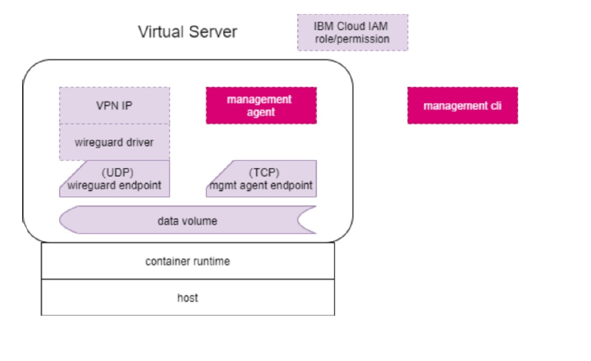

---

copyright:
  years: 2021, 2023
lastupdated: "2022-07-20"

subcollection: hp-virtual-servers

content-type: tutorial
services: hp-virtual-servers
account-plan: free
completion-time: 1h

keywords: secure networking, secure network, virtual server instance, instance, virtual server, VPN, secure CI/CD, confidential computing, confidential computing build, confidential computing CI/CD
---


{{site.data.keyword.attribute-definition-list}}

# Tutorial: Setting up the secure network
{: #tutorial_network}
{: toc-content-type="tutorial"}
{: toc-services="hp-virtual-servers"}
{: toc-completion-time="1h"}

This tutorial describes how you can set up the secure network which provides an end to end encrypted network communication for {{site.data.keyword.cloud}} {{site.data.keyword.hpvs}} services. This tutorial is intended for IBM Cloud Hyper Protect Virtual Servers customers. Contact your IBM representative for access to the GitHub repository.
{: shortdesc}

## Contents
{: #contents}

- [Basic concepts](#basicconcept_sn)
- [Before you begin](#prerequisites_sn)
- [Task flow](#taskflow_sn)
- [Command reference](#ref_sn)

## Basic concepts
{: #basicconcept_sn}

Some of the key features of the secure network are listed here:
- An end-to-end encrypted network.
- Controlled by the user rather than the cloud provider. The secure network configuration for a virtual server is managed by the user who creates the Hyper Protect Virtual Server instance, and this configuration cannot be modified by the IBM Cloud IAM user, nor by the IBM Cloud operator.

A user with administrator access to the Hyper Protect Virtual Server must set up the entire secure network and can configure multiple users to this role, who have access to the capabilities to manage the secure network and deploy solutions on the secure network.
{: note}


{: caption="Figure 1. The Secure network architecture" caption-side="bottom"}


1. The secure network management agent that runs on the {{site.data.keyword.hpvs}} receives commands from the secure network management agent CLI and updates the Virtual Private Network (VPN)  configuration on the {{site.data.keyword.hpvs}}, as requested.
2. The secure network management agent CLI receives the user command inputs and updates the VPN configuration of the {{site.data.keyword.hpvs}} by sending  requests to the secure network management agent that is running on the {{site.data.keyword.hpvs}}.
3. The secure network opens two endpoints on the virtual server network interface:    
   - In the data plane: A WireGuard endpoint (UDP port) that is used by the WireGuard driver.
   - In the control plane: A management agent endpoint (TCP port) that is used by the management agent.     
4. The secure network stores configuration data in files. The data volume should be mounted on the virtual server local persistent storage for the  secure network configuration data. All network configuration files are mounted at `/data/hpagent_store`.
5. The {{site.data.keyword.cloud}} Identity and Access Management (IAM) is used for user authentication. For more information, see [IBM Cloud  Identity and Access Management](https://cloud.ibm.com/docs/account?topic=account-iamoverview).


## Before you begin
{: #prerequisites_sn}

To complete this tutorial, you need to meet the following prerequisites:
- Administrator access to the Hyper Protect Virtual Server.
- Two {{site.data.keyword.hpvs}} instances.
- Install the IBM Cloud CLI.
* Install the `HPVS CLI plugin` version 1.4.17, of IBM Cloud. The `HPVS CLI plugin` is a dependency of the `hpnet CLI plugin`.
* Install the secure network CLI plugin by running the command `ibmcloud plugin install hpnet`. To install the plugin in the staging environment, complete the following steps:
   - Install from staging environment by running the `ibmcloud plugin install hpnet -r stage1` command.
   - To install plugin on production environment by running the `ibmcloud plugin install hpnet` command.   
* Log in to IBM Cloud by using the CLI. If you have multiple accounts, select the account that your service instance is created with. Make sure that you log in to the correct region and resource group where the service instance is located by running the  command `ibmcloud target -r <region> -g <resource_group>`


## Task flow
{: #taskflow_sn}

To complete this solution, you walk through the following steps:

1. [Configuring the virtual servers](#config_vs)
2. [Configuring the audit log](#configaudit_log)
3. [Admin key administration](#manage_adminkey)
4. [VPN administration](#vpn_admin)
5. [End to end encryption via the VPN tunnel](#vpn_tunnel)

## Step 1: Configuring the virtual servers
{: #config_vs}

The {{site.data.keyword.hpvs}} instances are considered as 'HPVS_A', and 'HPVS_B', in this tutorial. For each of these two instances, complete the following steps:
1. To install CA certificates, run the following command:
   ```buildoutcfg
   apt-get update && apt-get install -y ca-certificates
   ```
   {: pre}

2. Create the `authorized_user` file and save it at `/data/hpagent_store/authorized_user`, with a list of {{site.data.keyword.cloud_notm}} user IDs. The secure network management agent uses this list to approve a request and rejects any request that is not in this list.
   To create the `authorized_user` file, run the following commands:    
   ```buildoutcfg
   mkdir -p /data/hpagent_store
   cat <<EOF > /data/hpagent_store/authorized_user
   <email_of _authorized_user>
   EOF
   ```
   {: codeblock}

3. If the secure network management agent is deployed in a Hyper Protect Virtual Server instance which is in the staging environment (you should not run this command in the production environment), then you must export the following variable:
   ```buildoutcfg
   export isProduction=false
   ```
   {: pre}

4. To install the secure network management agent, download the files `dap-public.pem`, `encryptednetwork-2.0.0.tar.gz`, and  `encryptednetwork-2.0.0.tar.gz.sig` from this [GitHub repository](https://github.com/ibm-hyper-protect/secure-network/releases/tag/v2.0.0). Note that the secure network management agent and its repository are for allowlisted accounts. To get added to the allowlist, open a [case](https://cloud.ibm.com/unifiedsupport/cases/form){:external} with support. After you save the files to `/root`, or `/data`, and complete the following steps:
   - To verify secure network management agent's signature, run the following command.
     ```buildoutcfg
     openssl dgst -sha256 -verify dap-public.pem -signature encryptednetwork-2.0.0.tar.gz.sig encryptednetwork-2.0.0.tar.gz
     ```
     {: pre}

     The following snippet shows an example output.
     ```buildoutcfg
     encryptednetwork-2.0.0.tar.gz Verified OK
     ```


   - To extract the compressed file, run the following command.
     ```buildoutcfg
     tar -zxvf encryptednetwork-2.0.0.tar.gz
     ```
     {: pre}

    After you successfully extract the compressed file, the folder 'encryptednetwork' contains a file called `encryptednetwork`. To install and launch the secure network management agent, run the following commands:

    ```buildoutcfg
    mkdir /data/log/
    ```
    {: pre}

    ```buildoutcfg
    nohup ./encryptednetwork > /data/log/log.log 2>&1 &
    ```
    {: pre}

    The secure network management agent is now running.
    The following network configuration files are mounted at `/data/hpagent_store`:

    ```buildoutcfg
    /data/hpagent_store/authorized_user
    /data/hpagent_store/public.pem
    /data/hpagent_store/private.key
    /data/hpagent_store/agent_config
    /data/hpagent_store/connections-config
    ```
    {: codeblock}

    The `agent_config`, and `connections-config` files are automatically generated by the secure network management agent later.  You must configure only the `/data/hpagent_store/authorized_user` file. All the other files are created and maintained by the secure network management agent. You must ensure that the contents of the `/data/hpagent_store/agent_config` and `connections-config` files are not modified and is protected from inadvertent exposure because that can cause potential attacks on the system. To keep the data at this location safe, you should follow the guidance on [backup and restore](/docs/hp-virtual-servers?topic=hp-virtual-servers-disaster_hpvs).  

    After you complete these steps, the secure network management agent starts listening on the specified network port and is ready to accept requests from the secure network management CLI. These tasks can be done manually after connecting to the {{site.data.keyword.hpvs}} instance by using SSH, or when creating a container image in the case of BYOI.

    To prevent any malicious access, consider the following recommendations to control access to the Hyper Protect Virtual Server:
    - The secure network management agent binary and configuration files are highly sensitive and should never be exposed or altered. It is your responsibility to control access to the Hyper Protect Virtual Server.
    - Disable SSH access for your production environment when you have highly sensitive workloads. When you need to grant SSH access to the Hyper Protect Virtual Server to multiple users, you must control the permissions of SSH users, and configure the Hyper Protect Virtual Server file system permission to allow only designated users to access the secure network management agent binary and all configuration files, and prevent any other users from having any read, write, or execute on these files.
    - It is your responsibility to keep the SSH private key secure, if SSH is enabled for the Hyper Protect Virtual Server.  


    To prevent malicious access to the desktop that you used to set up and configure the secure network management, consider the following recommendations:
    - You must download and install the secure network management agent only from this [Github repository](https://github.com/ibm-hyper-protect/secure-network/releases/tag/v2.0.0), with the correct signature provided by IBM. Do not install any programs from any other address that does not have the correct signature from IBM, as it might be malicious and can cause potential attacks on the virtual server.
    - It is your responsibility to keep your desktop secure.
    - It is your responsibility to encrypt the admin private key and keep it secure.


## Step 2: Configuring the audit log
{: #configaudit_log}

Complete the following to configure Log Analysis to trace audit logs:
1. Create a LogDNA service instance
   - Create a logging service in the production environment in the `us-south` region.
   - Get the ingestion key.

   For more information about the LogDNA service, see [Configuring a Logging agent for Linux Ubuntu or Debian](https://cloud.ibm.com/docs/log-analysis?topic=log-analysis-config_agent_linux).
   {: note}

2. Monitor the {{site.data.keyword.hpvs}} instance via the LogDNA instance.
   - Log in to the {{site.data.keyword.hpvs}} instance (either staging or production in any region).
   - Configure the LogDNA agent on the {{site.data.keyword.hpvs}} instance
    ```buildoutcfg
    apt-get update
    apt-get install -y git npm curl wget
    npm install -g n
    n lts
    PATH="$PATH"
    node -v

    git clone https://github.com/logdna/logdna-agent.git
    cd logdna-agent && npm install
    node index.js -k <ingestion-key>
    node index.js -d /data/log
    node index.js -t logging
    node index.js -s LOGDNA_APIHOST=api.us-south.logging.cloud.ibm.com
    node index.js -s LOGDNA_LOGHOST=logs.us-south.logging.cloud.ibm.com
    node index.js
    ```
    {: codeblock}


    For more information about how to set up monitoring in {{site.data.keyword.hpvs}}, see [Monitoring logs](https://cloud.ibm.com/docs/hp-virtual-servers?topic=hp-virtual-servers-monitoring).
    {: note}

3. Check for logs of the configuration status from the LogDNA dashboard.

   The following actions are traced by the audit log:
   - 'Admin Public Key' >>> 'secure-network-admin-key'

   ```buildoutcfg
   secure-network-admin-key.read
   secure-network-admin-key.create
   secure-network-admin-key.update
   secure-network-admin-key.delete
   ```
   {: codeblock}

   - 'Connection' >>> 'secure-network-connection'

   ```buildoutcfg
   secure-network-connection.add
   secure-network-connection.update
   secure-network-connection.delete
   secure-network-connection.read
   ```
   {: codeblock}

   - 'Node' >>> 'secure-network-node'

   ```buildoutcfg
   secure-network-node.delete
   secure-network-node.create
   secure-network-node.update
   secure-network-node.read
   ```
   {: codeblock}

   The following snippet shows an example of an audit log:

   ```buildoutcfg
   {
       "action":"<hpvs service name>.secure-network-admin-key.delete",
       "initiator":{
           "id":token.IBMid,
           "name":token.sub,
           "typeURI":"service/security/account/user",
           "authnId":token.IBMid,
           "authnName":token.sub,
           "credential":{
               "type":"user"
           },
           "host":{
               "address":"9.197.247.35",
               "addressType":"IPv4",
               "agent":"grpc-go/1.38.0"
           }
       },
       "eventTime":"2021-07-14T10:27:00.39+0000",
       "logSourceCRN": <full CRN which is provided by user/customer>",
       "message":"Hyper Protect Virtual Server : delete secure-network-admin-key",
       "observer":{
           "name":"ActivityTracker"
     },
     "outcome":"success",
     "reason":{
         "reasonCode":200,
         "reasonType":"ok"
     },
     "saveServiceCopy":true,
     "severity":"critical",
     "target":{
         "name":"",
         "typeURI":"<hpvs service name>/secure-network-admin-key",
         "id":<full CRN which is provided by user/customer>,
         "resourceGroupId":<full CRN of resourceGroupId which is provided by HPVS team>
     },
     "dataEvent":true,
     "requestData":{
         "serviceInstanceId":<analysis from instance CRN>,
         "accountId":<token.account>,
         "adminPubKeyId":<token.IBMid>
     },
     "responseData":{
         "adminPubKeyId":<token.IBMid>
     }
   }
   ```
   {: codeblock}


## Step 3: Admin key administration
{: #manage_adminkey}

The secure network management CLI stores the newly generated key pair in the local file system, the private key is derived by using PBKDF2, which is aligned with the PKCS#5 standard, and the private key is protected by a mandatory passphrase. The private key is stored in a local file that follows the PKCS#8 standard, and you must ensure that you protect the passphrase and keep the private key file secure. The secure network management CLI uses the private key to sign the request to upload the public key to the secure network management agent over the secure connection. Thereafter, the uploaded public key is associated with the user ID, and works as the administrator key to authenticate all subsequent operations that the specified user executes.

After this is complete, the secure network management agent is ready to accept requests from the secure network management CLI to perform secure network administration including admin key management and VPN management. The administration requests are signed with the user provided admin private key (except reading requests which do not make any changes on the secure network), and are authenticated by the uploaded corresponded admin public key.


### Choosing the target {{site.data.keyword.hpvs}} instance
{: #choose_targethpvs}

After you login in to IBM Cloud, ensure that you have access to all {{site.data.keyword.hpvs}} instances that are required for establishing a VPN connection with each other. You can run the `ibmcloud hpvs instances` command from the IBM Cloud CLI to view all available {{site.data.keyword.hpvs}} instances that you have access to.

```buildoutcfg
ibmcloud hpvs instances

Getting instances ...


Name                     hpnet-test1   
CRN                      crn:v1:staging:public:hpvs:dal10:a/9f63166137084e9d9131e42bfce481a6:8ba48f91-ef4a-4433-b411-fd8b2becc18b::   
Location                 dal10   
Cloud tags                  
Cloud state              active   
Server status            running   
Plan                     Free  
Public IP address        52.117.54.147   
Internal IP address      172.17.24.116   
Boot disk                25 GiB   
Data disk                25 GiB   
Memory                   2048 MiB   
Processors               1 vCPUs   
Image type               ibm-provided   
Image OS                 ubuntu20.04   
Public key fingerprint   RA1/M9gnMnz831+Q4pGpZ74/BPcJV047zIHb5HCaxOs   
Last operation           create succeeded   
Last image update        -   
Created                  2022-03-04   


Name                     hpnet-test2   
CRN                      crn:v1:staging:public:hpvs:dal10:a/9f63166137084e9d9131e42bfce481a6:1b763c10-2970-48aa-88d8-9c63fb66cc7d::   
Location                 dal10   
Cloud tags                  
Cloud state              active   
Server status            running   
Plan                     Free   
Public IP address        52.117.54.138   
Internal IP address      172.17.24.117   
Boot disk                25 GiB   
Data disk                25 GiB   
Memory                   2048 MiB   
Processors               1 vCPUs   
Image type               ibm-provided   
Image OS                 ubuntu20.04   
Public key fingerprint   RA1/M9gnMnz831+Q4pGpZ74/BPcJV047zIHb5HCaxOs   
Last operation           create succeeded   
Last image update        -   
Created                  2022-03-04   
```
{: codeblock}


The command flag `--instance <NAME | CRN>` in all commands is optional, you can provide the value of this flag if you already know the `NAME` or `CRN` of this {{site.data.keyword.hpvs}} instance, or waiting for prompt of the CLI to choose the target {{site.data.keyword.hpvs}} instance during CLI execution. The following snippet shows an example:

```buildoutcfg
ibmcloud hpnet adminkey set

Select the HPVS instance for '--instance'

Select a virtual server:
1. hpnet-test1 - crn:v1:staging:public:hpvs:dal10:a/9f63166137084e9d9131e42bfce481a6:8ba48f91-ef4a-4433-b411-fd8b2becc18b::
2. hpnet-test2 - crn:v1:staging:public:hpvs:dal10:a/9f63166137084e9d9131e42bfce481a6:1b763c10-2970-48aa-88d8-9c63fb66cc7d::
Enter a number>
```
{: codeblock}


```buildoutcfg
ibmcloud hpnet adminkey set --instance "hpnet test1"

Generating public/private ed25519 key pair for the admin of hpnet test1...
```
{: codeblock}


```buildoutcfg
ibmcloud hpnet adminkey set --instance "crn:v1:staging:public:hpvs:dal10:a/9f63166137084e9d9131e42bfce481a6:8ba48f91-ef4a-4433-b411-fd8b2becc18b::"

Generating public/private ed25519 key pair for the admin of hpnet test1...
```
{: codeblock}


### Setting up a new admin key pair
{: #setting_admin_key}

1. To set the `adminkey` by using an auto-generated admin keypair on {{site.data.keyword.hpvs}} instance 'HPVS_A', complete the following steps:

   ```buildoutcfg
   ibmcloud hpnet adminkey set

   Select the HPVS instance for '--instance'

   Select a virtual server:
   1. hpnet-test1 - crn:v1:staging:public:hpvs:dal10:a/9f63166137084e9d9131e42bfce481a6:8ba48f91-ef4a-4433-b411-fd8b2becc18b::
   2. hpnet-test2 - crn:v1:staging:public:hpvs:dal10:a/9f63166137084e9d9131e42bfce481a6:1b763c10-2970-48aa-88d8-9c63fb66cc7d::
   Enter a number>
   ```
   {: codeblock}


   Enter number `1`  to select `hpnet test1`, you are then prompted to enter a passphrase to encrypt the private key:

   ```buildoutcfg
   ibmcloud hpnet adminkey set --instance "hpnet test1"

   Generating public/private ed25519 key pair for the admin of hpnet-test1...

   Enter passphrase of the private key>
   Enter same passphrase again>
   OK
   ```
   {: codeblock}


   Enter a passphrase that you can remember. If you are doing this the first time, the CLI prompts you to authenticate the {{site.data.keyword.hpvs}} instance, to verify if the server side certification is trusted. If the server side certification is trusted, the fingerprint of the server certification is recorded in the local file (`$HOME/.hpnet-cfg/known_instances`), this avoids repeated authentication requests in subsequently run commands:

   ```buildoutcfg
   Starting to encrypt key '/Users/hexiaohu/.hpnet-cfg/temp/hpnet-test1-83-92-b6-4b.priv.tmp'....

   Connecting to the server hpnet-test1 [52.117.54.147] ...

   Verify the connecting server’s certificate before connecting:
   -------------------------------------------------------------------
   the DNS      =[127.0.0.1 localhost]
   the Subject  =[CN=Digital Asset,O=IBM,C=CN]
   the Signature=[A3:48:B6:1F:63:07:00:38:7F:A4:9E:98:81:CE:78:18:31:B1:EE:3E:45:81:7C:5F:18:C1:4D:1E:C8:A9:FD:95:94:B6:0F:CB:97:8D:A8:F1:E0:BB:AB:9A:51:82:86:7D:CB:71:60:47:FD:D9:D1:B5:26:81:69:C9:CD:84:5D:0C]
   the SHA256 fingerprint=[75:90:01:22:B4:C7:75:71:4B:F1:26:97:4D:D9:53:2D:04:A4:4F:F4:96:D5:ED:BD:17:C1:8B:69:2C:2A:38:5A]
   -------------------------------------------------------------------
   Confirm to connect to the server? [y/N]> y

   OK

   Continue connecting to the server...

   Configuring the public key of the admin...

   The new generated key pair:
   +-------------------------------------------------------------+------------+---------------------------------------------------------+
   | FINGERPRINT(SHA1)                                           | KEYTYPE    | FILE                                                    |
   +-------------------------------------------------------------+------------+---------------------------------------------------------+
   | de:fd:53:4f:27:95:65:eb:8b:e8:e7:7e:3e:00:75:bb:53:36:b2:ab | PrivateKey | /Users/hexiaohu/.hpnet-cfg/hpnet-test1-83-92-b6-4b.priv |
   | 41:bf:6a:3a:dd:c5:41:45:89:77:b6:5b:b8:67:6c:38:83:92:b6:4b | PublicKey  | /Users/hexiaohu/.hpnet-cfg/hpnet-test1-83-92-b6-4b.pub  |
   +-------------------------------------------------------------+------------+---------------------------------------------------------+

   An automatically generated keypair is stored locally and configured to node remotely.
   The keypair is required to keep carefully!!!


   OK
   ```
   {: codeblock}


2. To set the `adminkey` by using an auto-generated admin keypair on {{site.data.keyword.hpvs}} instance 'HPVS_B', complete the following steps:

   ```buildoutcfg
   ibmcloud hpnet adminkey set

   select the HPVS instance for parameter [--instance]:

   Select a virtual server:
   1. hpnet test1 - crn:v1:staging:public:hpvs:dal10:a/9f63166137084e9d9131e42bfce481a6:3dc2e108-15b3-49db-8664-a7a64235ff97::
   2. hpnet test2 - crn:v1:staging:public:hpvs:dal12:a/9f63166137084e9d9131e42bfce481a6:dcf3abcf-4770-4945-9888-96e67eb61b11::
   Enter a number>
   ```
   {: codeblock}


   Enter number `2` to select `hpnet test2`, you are then prompted to enter a passphrase to encrypt the private key:

   ```buildoutcfg
   ibmcloud hpnet adminkey  set --instance hpnet-test2

   Generating public/private ed25519 key pair for the admin of hpnet-test2...

   Enter passphrase of the private key>
   Enter same passphrase again>
   OK
   ```
   {: codeblock}


   Enter a passphrase that you can remember. If you are doing this the first time, the CLI prompts you to authenticate the {{site.data.keyword.hpvs}} instance, to verify if the server side certification is trusted or not. If the server side certification is trusted, the fingerprint of the server certification is recorded in a local file (`$HOME/.hpnet-cfg/known_instances`), to avoid repeated authentication requests in subsequently run commands:

   ```buildoutcfg
   Starting to encrypt key '/Users/hexiaohu/.hpnet-cfg/temp/hpnet-test2-71-20-39-e8.priv.tmp'....

   Connecting to the server hpnet-test2 [52.117.54.138] ...

   Verify the connecting server’s certificate before connecting:
   -------------------------------------------------------------------
   the DNS      =[127.0.0.1 localhost]
   the Subject  =[CN=Digital Asset,O=IBM,C=CN]
   the Signature=[E5:14:1B:C8:C8:07:46:D7:41:52:E9:EE:49:EB:61:97:58:7F:DB:9B:B2:B5:F4:B9:64:D6:09:F2:4A:4A:DA:ED:D8:7C:65:CE:EA:55:17:C1:4F:C9:8C:06:1E:F6:65:73:87:63:C8:C7:51:02:94:58:97:9C:21:99:51:51:52:0F]
   the SHA256 fingerprint=[FE:53:C8:32:57:1B:4F:52:F5:7B:2C:EF:90:87:AB:01:F0:86:C2:22:4C:F5:68:29:67:FE:F7:82:EA:29:2D:FC]
   -------------------------------------------------------------------
   Confirm to connect to the server? [y/N]> y

   OK

   Continue connecting to the server...

   Configuring the public key of the admin...

   The new generated key pair:
   +-------------------------------------------------------------+------------+---------------------------------------------------------+
   | FINGERPRINT(SHA1)                                           | KEYTYPE    | FILE                                                    |
   +-------------------------------------------------------------+------------+---------------------------------------------------------+
   | 05:5e:49:90:fa:6b:f1:38:48:c9:db:34:1e:53:4b:84:75:0b:8f:b1 | PrivateKey | /Users/hexiaohu/.hpnet-cfg/hpnet-test2-71-20-39-e8.priv |
   | ef:ff:ad:46:2a:b4:0b:32:38:7f:29:7f:15:a1:a3:bd:71:20:39:e8 | PublicKey  | /Users/hexiaohu/.hpnet-cfg/hpnet-test2-71-20-39-e8.pub  |
   +-------------------------------------------------------------+------------+---------------------------------------------------------+

   An automatically generated keypair is stored locally and configured to node remotely.
   The keypair is required to keep carefully!!!


   OK
   ```
   {: codeblock}


### Retrieve the private key
{: #retrieve_key}

If you do not move the generated private key, the file path can be automatically parsed during fetching of the admin public key.

```buildoutcfg
ibmcloud hpnet adminkey get

Select the HPVS instance for '--instance'

Select a virtual server:
1. hpnet-test1 - crn:v1:staging:public:hpvs:dal10:a/9f63166137084e9d9131e42bfce481a6:8ba48f91-ef4a-4433-b411-fd8b2becc18b::
2. hpnet-test2 - crn:v1:staging:public:hpvs:dal10:a/9f63166137084e9d9131e42bfce481a6:1b763c10-2970-48aa-88d8-9c63fb66cc7d::
Enter a number> 1

Connecting to the server hpnet-test1 [52.117.54.147] ...

The connecting server's certificate is valid and already confirmed in previous command
The certificate can be confirmed again by removing the HPVS instance from file /Users/hexiaohu/.hpnet-cfg/known_instances

Continue connecting to the server...

Querying the public key of the admin...

The retrieved public key:
+---------------+-----------+----------------------------------------------+---------------------------------------------------------+
| INSTANCE_NAME | KEYTYPE   | VALUE(BASE64)                                | PRIVATEKEY                                              |
+---------------+-----------+----------------------------------------------+---------------------------------------------------------+
| hpnet-test1   | PublicKey | 1BCBy+SEWAEigYQPWXHpkJh039ZUZ4ie42AUrMi7MvM= | /Users/hexiaohu/.hpnet-cfg/hpnet-test1-83-92-b6-4b.priv |
+---------------+-----------+----------------------------------------------+---------------------------------------------------------+


OK

```
{: codeblock}


## Step 4: VPN administration
{: #vpn_admin}

The VPN administration tasks must be performed by a user who has a valid {{site.data.keyword.cloud_notm}} user account and a valid secure network admin key pair (by using [these](#manage_adminkey) procedures).

The VPN administration involves the following tasks:
- [Setting up a VPN node](#setup_vpnnode)
- [Setting up VPN trusted peers](#set_vpnpeer)

See [Parameter specification](#param_limit) for details about some specifications that apply to some of the parameters of the secure network management CLI commands.

### Setting up a VPN node
{: #setup_vpnnode}

Use the secure network management CLI to send a request to the secure network management agent to configure a new VPN node on the virtual server. The VPN key pair is generated by the secure network management agent automatically on the virtual server. You must configure the VPN IP of the VPN node during the initialization command.

Now a new VPN virtual network interface is created on the virtual server and configured with the parameters provided by the administrator, from the secure network management CLI.

1. To set up the VPN Node for 'HPVS_A', complete the following steps:
   - Export the following values which you will use in the following sections:
     ```buildoutcfg
     export VPN_IP_A=10.10.10.1
     ```
     {: pre}

     ```buildoutcfg
     export HPVS_A="hpnet-test1"
     ```
     {: pre}

     ```buildoutcfg
     export ADMIN_PRIV_KEY_A=/Users/hexiaohu/.hpnet-cfg/hpnet-test1-83-92-b6-4b.priv
     ```
     {: pre}


   - To set up the VPN Node, run the following command (Note: The passphrase to decrypt the private key is required when executing the command):
     ```buildoutcfg
     ibmcloud hpnet node init --instance "$HPVS_A" --vpn-ip "$VPN_IP_A" --admin-priv-key "$ADMIN_PRIV_KEY_A"

     Enter passphrase to use the private key '--admin-priv-key'>
     OK

     Starting to decrypt key '/Users/hexiaohu/.hpnet-cfg/hpnet-test1-83-92-b6-4b.priv'....

     Connecting to the server hpnet-test1 [52.117.54.147] ...

     The connecting server's certificate is valid and already confirmed in previous command
     The certificate can be confirmed again by removing the HPVS instance from file /Users/hexiaohu/.hpnet-cfg/known_instances

     Continue connecting to the server...

     Initializing the node hpnet-test1 ...

     OK
     Node hpnet-test1 was initialized.
     ```
     {: codeblock}


2. To set up the VPN Node for 'HPVS_B', complete the following steps:
   - Export the following values which you will use in the following sections:
     ```buildoutcfg
     export VPN_IP_B=10.10.10.2
     ```
     {: pre}

     ```buildoutcfg
     export HPVS_B="hpnet-test2"
     ```
     {: pre}

     ```buildoutcfg
     export ADMIN_PRIV_KEY_B=/Users/hexiaohu/.hpnet-cfg/hpnet-test2-71-20-39-e8.priv
     ```
     {: pre}


   - To set up the VPN Node, run the following command:
     ```buildoutcfg
     ibmcloud hpnet node init --instance "$HPVS_B" --vpn-ip "$VPN_IP_B" --admin-priv-key "$ADMIN_PRIV_KEY_B"

     Enter passphrase to use the private key '--admin-priv-key'>
     OK

     Starting to decrypt key '/Users/hexiaohu/.hpnet-cfg/hpnet-test2-71-20-39-e8.priv'....

     Connecting to the server hpnet-test2 [52.117.54.138] ...

     The connecting server's certificate is valid and already confirmed in previous command
     The certificate can be confirmed again by removing the HPVS instance from file /Users/hexiaohu/.hpnet-cfg/known_instances

     Continue connecting to the server...

     Initializing the node hpnet-test2 ...

     OK
     Node hpnet-test2 was initialized.
     ```
     {: codeblock}


### Setting up a VPN connection between two VPN nodes
{: #set_vpnpeer}

To set up the VPN connection, the first step would be for the administrator of virtual server A to submit a connection request from virtual server A to virtual server B. Virtual server B will get a pending request from virtual server A. The second step would be for the administrator of virtual server B to query the incoming pending requests, and then approve the requests. Thereafter, the connection requests are approved and the state of the connection requests are changed from pending to connected. The VPN connection is now established between the two virtual servers.

1. To set up the VPN connection on VPN node 'HPVS_A', complete the following steps (after the command executes successfully, the connection state should be `pending`):
   ```buildoutcfg
   ibmcloud hpnet connect add --instance "$HPVS_A" --target "$HPVS_B" --admin-priv-key "$ADMIN_PRIV_KEY_A"

   Enter passphrase to use the private key '--admin-priv-key'>
   OK

   Starting to decrypt key '/Users/hexiaohu/.hpnet-cfg/hpnet-test1-83-92-b6-4b.priv'....

   Connecting to the server hpnet-test1 [52.117.54.147] ...

   The connecting server's certificate is valid and already confirmed in previous command
   The certificate can be confirmed again by removing the HPVS instance from file /Users/hexiaohu/.hpnet-cfg/known_instances

   Continue connecting to the server...

   Adding a connection between hpnet-test1 and hpnet-test2 ...

   The added connection:
   +---------------+-------------+---------+
   | INSTANCE_NAME | TARGET_NAME | STATE   |
   +---------------+-------------+---------+
   | hpnet-test1   | hpnet-test2 | pending |
   +---------------+-------------+---------+

   OK

   ```
   {: codeblock}


2. To accept the VPN connection on VPN node 'HPVS_B', complete the following steps (after the command executes successfully, the connection state should be `connected`):
   ```buildoutcfg
   ibmcloud hpnet connect add --instance "$HPVS_B" --target "$HPVS_A" --admin-priv-key "$ADMIN_PRIV_KEY_B"


   Enter passphrase to use the private key '--admin-priv-key'>
   OK

   Starting to decrypt key '/Users/hexiaohu/.hpnet-cfg/hpnet-test2-71-20-39-e8.priv'....

   Connecting to the server hpnet-test2 [52.117.54.138] ...

   The connecting server's certificate is valid and already confirmed in previous command
   The certificate can be confirmed again by removing the HPVS instance from file /Users/hexiaohu/.hpnet-cfg/known_instances

   Continue connecting to the server...

   Adding a connection between hpnet-test2 and hpnet-test1 ...

   The added connection:
   +---------------+-------------+-----------+
   | INSTANCE_NAME | TARGET_NAME | STATE     |
   +---------------+-------------+-----------+
   | hpnet-test2   | hpnet-test1 | connected |
   +---------------+-------------+-----------+

      OK
   ```
   {: codeblock}


## Step 5: End to end encryption via the VPN tunnel
{: #vpn_tunnel}

After setting up the admin key, the VPN node, and the VPN trusted peers, complete the following steps to encrypt the connection between the two Hyper Protect Virtual Server instances.

1. Start a service on 'HPVS_A' by binding to the VPN IP, which is ${VPN_IP_A}, as set earlier in this tutorial.
2. Have a client on 'HPVS_B' connect to the service running on 'HPVS_A' by using the VPN IP, which is ${VPN_IP_A}, as set earlier in this tutorial.
3. Now the connection between the client on HPVS_B and the service on HPVS_A are end to end encrypted via the VPN tunnel.


## Command reference
{: #ref_sn}

* To view the details of the commands and their parameters, type the command you want view with the `--help` option, for example the following command shows you details about the `hpnet adminkey set` command:

   ```buildoutcfg
   ibmcloud hpnet adminkey set --help
   NAME:
     set - Set the admin keypair

   USAGE:
     ibmcloud hpnet adminkey set [--instance <NAME | CRN>]

   OPTIONS:
     --instance  The hpvs instance name or crn
   ```
   {: codeblock}


* The `adminkey get` command, to retrieve the configured admin public key

   ```buildoutcfg
   ibmcloud hpnet adminkey get --instance "$HPVS_A"


   Connecting to the server hpnet-test1 [52.117.54.147] ...

   The connecting server's certificate is valid and already confirmed in the previous command
   The certificate can be confirmed again by removing the HPVS instance from file /Users/hexiaohu/.hpnet-cfg/known_instances

   Continue connecting to the server...

   Querying the public key of the admin...

   The retrieved public key:
   +---------------+-----------+----------------------------------------------+---------------------------------------------------------+
   | INSTANCE_NAME | KEYTYPE   | VALUE(BASE64)                                | PRIVATEKEY                                              |
   +---------------+-----------+----------------------------------------------+---------------------------------------------------------+
   | hpnet-test1   | PublicKey | 1BCBy+SEWAEigYQPWXHpkJh039ZUZ4ie42AUrMi7MvM= | /Users/hexiaohu/.hpnet-cfg/hpnet-test1-83-92-b6-4b.priv |
   +---------------+-----------+----------------------------------------------+---------------------------------------------------------+


   OK

   ```
   {: codeblock}


* The `adminkey update` command, to generate a new keypair and update the admin public key on the VPN node

   ```buildoutcfg
   ibmcloud hpnet adminkey update --instance "$HPVS_A" --admin-priv-key "$ADMIN_PRIV_KEY_A"


   Generating public/private ed25519 key pair for the admin of hpnet-test1...

   Enter passphrase of the private key>
   Enter same passphrase again>
   OK

   Starting to encrypt key '/Users/hexiaohu/.hpnet-cfg/temp/hpnet-test1-a5-d8-9a-25.priv.tmp'....

   Enter passphrase to use the private key '--admin-priv-key'>
   OK

   Starting to decrypt key '/Users/hexiaohu/.hpnet-cfg/hpnet-test1-83-92-b6-4b.priv'....

   Connecting to the server hpnet-test1 [52.117.54.147] ...

   The connecting server's certificate is valid and already confirmed in the previous command
   The certificate can be confirmed again by removing the HPVS instance from file /Users/hexiaohu/.hpnet-cfg/known_instances

   Continue connecting to the server...

   Refreshing the public key of the admin...

   The new generated key pair:
   +-------------------------------------------------------------+------------+---------------------------------------------------------+
   | FINGERPRINT(SHA1)                                           | KEYTYPE    | FILE                                                    |
   +-------------------------------------------------------------+------------+---------------------------------------------------------+
   | f7:25:20:96:96:47:46:ec:b7:b5:a1:ff:53:62:68:dd:cb:21:6d:9c | PrivateKey | /Users/hexiaohu/.hpnet-cfg/hpnet-test1-a5-d8-9a-25.priv |
   | 04:03:60:c8:52:5f:dc:b4:93:1b:fc:7f:62:d1:a9:54:a5:d8:9a:25 | PublicKey  | /Users/hexiaohu/.hpnet-cfg/hpnet-test1-a5-d8-9a-25.pub  |
   +-------------------------------------------------------------+------------+---------------------------------------------------------+

   An automatically generated keypair is stored locally and configured to node remotely.
   The keypair is required to keep carefully!!!


   OK
   ```
   {: codeblock}


   ```buildoutcfg
   ibmcloud hpnet adminkey delete --instance "$HPVS_A" --admin-priv-key "$ADMIN_PRIV_KEY_A"


   Enter passphrase to use the private key '--admin-priv-key'>
   OK

   Starting to decrypt key '/Users/hexiaohu/.hpnet-cfg/hpnet-test1-a5-d8-9a-25.priv'....

   Connecting to the server hpnet-test1 [52.117.54.147] ...

   The connecting server's certificate is valid and already confirmed in the previous command
   The certificate can be confirmed again by removing the HPVS instance from file /Users/hexiaohu/.hpnet-cfg/known_instances

   Continue connecting to the server...

   Deleting the public key of the admin...

   OK
   The public key of the admin was deleted.

   ```
   {: codeblock}


* The `hpnet node get` command, to get the configuration on the VPN node

   ```buildoutcfg
   ibmcloud hpnet node get --instance "$HPVS_A"


   Connecting to the server hpnet-test1 [52.117.54.147] ...

   The connecting server's certificate is valid and already confirmed in the previous command
   The certificate can be confirmed again by removing the HPVS instance from file /Users/hexiaohu/.hpnet-cfg/known_instances

   Continue connecting to the server...

   Querying detail of the node hpnet-test1 ...
   +-----------------+----------------------------------------------+
   | NODE_PROPERTIES | VALUES                                       |
   +-----------------+----------------------------------------------+
   | VPNPublicKey    | zHlHCJCV7ub7FJjAWOXGZU3BV/rQOLMwMCq2dqOKsW0= |
   | VPNIp           | 10.10.10.1/24                                |
   +-----------------+----------------------------------------------+


   OK

   ```
   {: codeblock}


* The `hpnet node refresh` command, to refresh the keypair of the VPN connection

   ```buildoutcfg
   ibmcloud hpnet node refresh --instance "$HPVS_A" --admin-priv-key "$ADMIN_PRIV_KEY_A"


   Enter passphrase to use the private key '--admin-priv-key'>
   OK

   Starting to decrypt key '/Users/hexiaohu/.hpnet-cfg/hpnet-test1-c3-10-f7-a3.priv'....

   Connecting to the server hpnet-test1 [52.117.54.147] ...

   The connecting server's certificate is valid and already confirmed in the previous command
   The certificate can be confirmed again by removing the HPVS instance from file /Users/hexiaohu/.hpnet-cfg/known_instances

   Continue connecting to the server...

   Refreshing the node hpnet-test1 ...

   The refreshed connections:
   +---------------+-------------+-----------+--------------+-------+
   | INSTANCE_NAME | TARGET_NAME | STATE     | SYNCHRONIZED | ERROR |
   +---------------+-------------+-----------+--------------+-------+
   | hpnet-test1   | hpnet-test2 | connected | true         |       |
   +---------------+-------------+-----------+--------------+-------+


   OK
   Node hpnet-test1 was refreshed.
   ```
   {: codeblock}


* The `hpnet node delete` command, to clear the configuration of the VPN node

   ```buildoutcfg
   ibmcloud hpnet node delete --instance "$HPVS_A" --admin-priv-key "$ADMIN_PRIV_KEY_A"


   Enter passphrase to use the private key '--admin-priv-key'>
   OK

   Starting to decrypt key '/Users/hexiaohu/.hpnet-cfg/hpnet-test1-c3-10-f7-a3.priv'....

   Connecting to the server hpnet-test1 [52.117.54.147] ...

   The connecting server's certificate is valid and already confirmed in the previous command
   The certificate can be confirmed again by removing the HPVS instance from file /Users/hexiaohu/.hpnet-cfg/known_instances

   Continue connecting to the server...

   Deleting the node hpnet-test1 ...

   OK
   Node hpnet-test1 was deleted.
   ```
   {: codeblock}


* The `hpnet connect list` command, to get view all configured VPN links on the VPN node:

   ```buildoutcfg
   ibmcloud hpnet connect list --instance "$HPVS_A"


   Connecting to the server hpnet-test1 [52.117.54.147] ...

   The connecting server's certificate is valid and already confirmed in previous command
   The certificate can be confirmed again by removing the HPVS instance from file /Users/hexiaohu/.hpnet-cfg/known_instances

   Continue connecting to the server...

   Querying connections of hpnet-test1 ...

   The connections:
   +---------------+-------------+----------+-----------+--------------+
   | INSTANCE_NAME | TARGET_NAME | TYPE     | STATE     | SYNCHRONIZED |
   +---------------+-------------+----------+-----------+--------------+
   | hpnet-test1   | hpnet-test2 | outgoing | connected | true         |
   +---------------+-------------+----------+-----------+--------------+

   OK
   ```
   {: codeblock}


* The `hpnet connect sync` command, to synchronize the connection configuration which might be refreshed but out of synchronization on any of the VPN node:

   ```buildoutcfg
   ibmcloud hpnet connect sync --instance "$HPVS_A" --target "$HPVS_B"  --admin-priv-key "$ADMIN_PRIV_KEY_A"


   Enter passphrase to use the private key '--admin-priv-key'>
   OK

   Starting to decrypt key '/Users/hexiaohu/.hpnet-cfg/hpnet-test1-c3-10-f7-a3.priv'....

   Connecting to the server hpnet-test1 [52.117.54.147] ...

   The connecting server's certificate is valid and already confirmed in previous command
   The certificate can be confirmed again by removing the HPVS instance from file /Users/hexiaohu/.hpnet-cfg/known_instances

   Continue connecting to the server...

   Synchronizing the connection between hpnet-test1 and hpnet-test2 ...

   OK
   The connection between hpnet-test1 and hpnet-test2 was synchronized.
   ```
   {: codeblock}


* The `hpnet connect delete` command, to delete the connection between two VPN nodes:

   ```buildoutcfg
   ibmcloud hpnet connect delete --instance "$HPVS_A" --target "$HPVS_B"  --admin-priv-key "$ADMIN_PRIV_KEY_A"


   Enter passphrase to use the private key '--admin-priv-key'>
   OK

   Starting to decrypt key '/Users/hexiaohu/.hpnet-cfg/hpnet-test1-c3-10-f7-a3.priv'....

   Connecting to the server hpnet-test1 [52.117.54.147] ...

   The connecting server's certificate is valid and already confirmed in previous command
   The certificate can be confirmed again by removing the HPVS instance from file /Users/hexiaohu/.hpnet-cfg/known_instances

   Continue connecting to the server...

   Deleting the connection between hpnet-test1 and hpnet-test2 ...

   OK
   The connection between hpnet-test1 and hpnet-test2 was deleted.
   ```
   {: codeblock}


## Parameter specification
{: #param_limit}

The following table lists the specifications that apply to some of the parameters of the CLI commands.

| Parameter     | Specification   |
| ----- | --------- |
| vpn-ip     |  An IP address (a.b.c.d) or CIDR format IP address (a.b.c.d/n). If the subnet is not specified, by default it is /24     |
{: caption="Table 1. Parameter specification" caption-side="bottom"}
